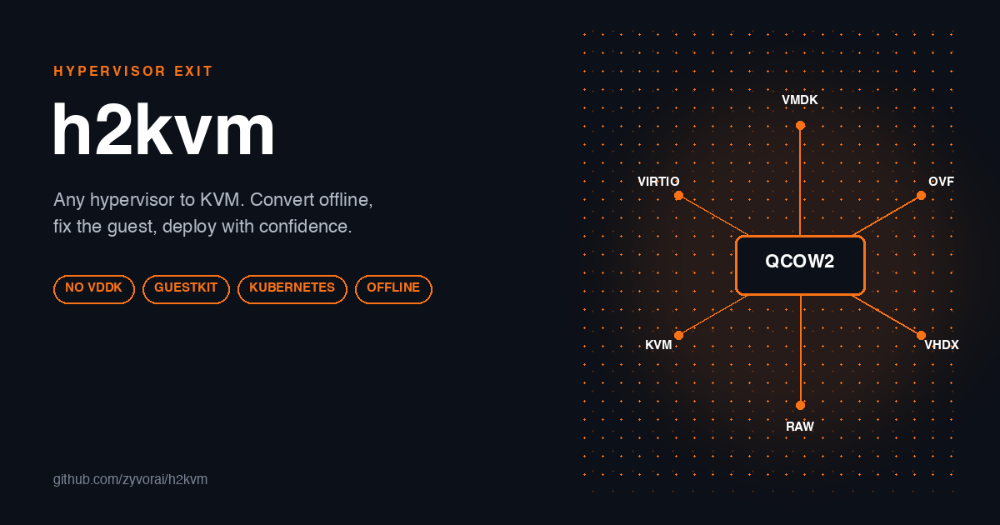
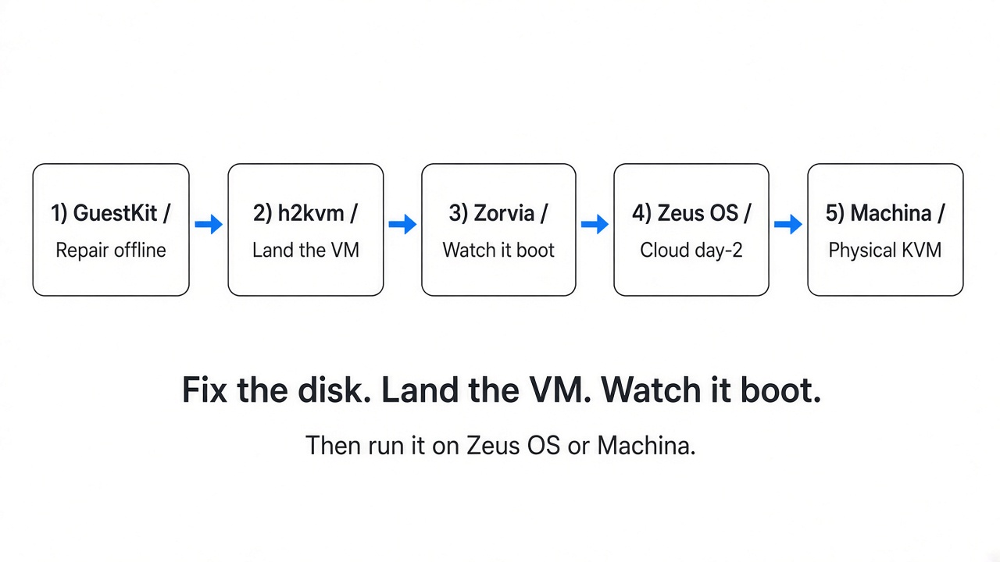
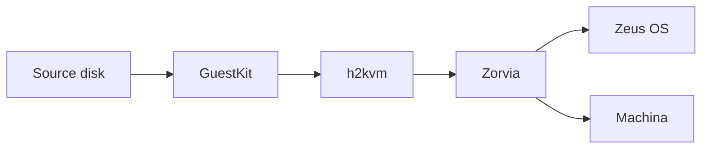
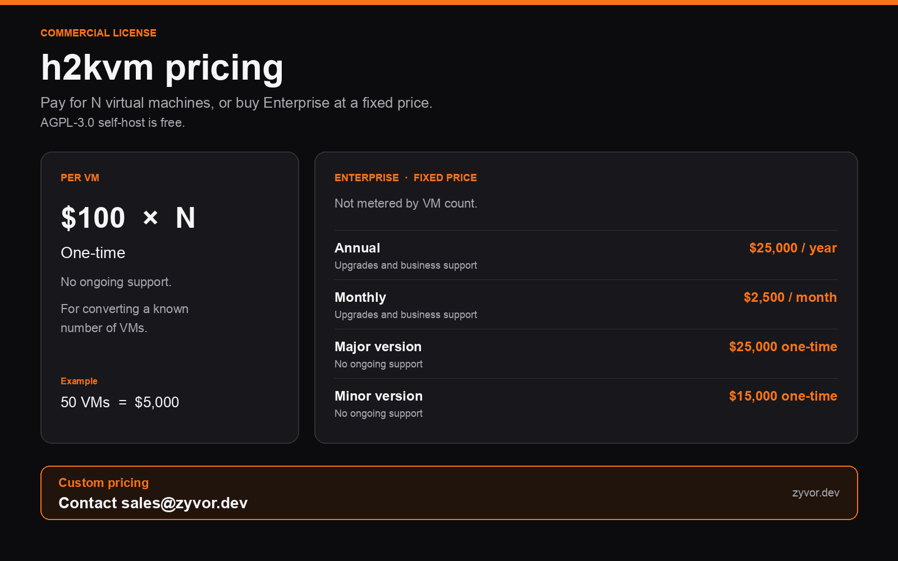

<div align="center">

# h2kvm

### Any hypervisor → KVM. Convert offline. Fix the guest. Deploy with confidence.

Export, convert, and deploy VMs from **VMware, Hyper-V, Nutanix, AWS, Azure, GCP** and more —  
with offline guest fixes, a web control plane, and a Kubernetes-native operator.

**First-boot science for hypervisor exit** · day-2 on **[Zeus OS](https://zyvor.dev/zeus-os)** · part of the [Zyvor](https://zyvor.dev/?utm_source=github&utm_medium=h2kvm&utm_campaign=readme_hero) suite



<br/>

[](https://github.com/zyvorai/h2kvm/releases/tag/v1.2.0)
[](https://pypi.org/project/hypersdk-guestkit/)
[](https://www.python.org/)
[](LICENSE)

<br/>

[](https://zyvor.dev/contact?intent=demo&utm_source=github&utm_medium=h2kvm&utm_campaign=readme_hero)
[](https://zyvor.dev/poc?utm_source=github&utm_medium=h2kvm&utm_campaign=readme_hero)
[](https://www.youtube.com/watch?v=lQP1sd5Ftkc)

**[How it works](#how-it-works)** ·
**[No VDDK](#no-vddk)** ·
**[Install](#install)** ·
**[Quick start](#quick-start)** ·
**[GuestKit](#guestkit)** ·
**[Remote deploy](#remote-lab-deploy)** ·
**[Demos](#see-it-in-action)** ·
**[CE vs Enterprise](#community-vs-enterprise)** ·
**[Docs](docs/README.md)** ·
**[Product](https://zyvor.dev/h2kvm?utm_source=github&utm_medium=h2kvm)**

</div>

---

## How it works

The disk is fixed before it is powered on. Then you watch it boot, and you can run it on [Zeus OS](https://zyvor.dev/zeus-os) or [Machina](https://zyvor.dev/machina). The public pages are on [zyvor.dev](https://zyvor.dev).



```text
  source disk
      →  GuestKit     inspect the disk before power-on     zyvor.dev/guestkit
      →  h2kvm        any hypervisor to KVM                zyvor.dev/h2kvm
      →  Zorvia       KubeVirt VMs, no hand-written CRDs   zyvor.dev/zorvia
      →  Zeus OS      visual OS for KubeVirt               zyvor.dev/zeus-os
      →  Machina      control plane for libvirt hosts      zyvor.dev/machina

  First boot is planned, and you can see it.
```



| Product | What zyvor.dev says | Site | Repo |
|---------|---------------------|------|------|
| [GuestKit](https://zyvor.dev/guestkit) | Inspects the disk offline so you know it is safe before power-on | [zyvor.dev/guestkit](https://zyvor.dev/guestkit) | [zyvorai/guestkit](https://github.com/zyvorai/guestkit) |
| [h2kvm](https://zyvor.dev/h2kvm) | Any hypervisor to KVM. The guest is fixed so the VM boots the first time | [zyvor.dev/h2kvm](https://zyvor.dev/h2kvm) | [zyvorai/h2kvm](https://github.com/zyvorai/h2kvm) |
| [Zorvia](https://zyvor.dev/zorvia) | Craft and run KubeVirt VMs without hand-written CRDs | [zyvor.dev/zorvia](https://zyvor.dev/zorvia) | [zyvorai/zorvia](https://github.com/zyvorai/zorvia) |
| [Zeus OS](https://zyvor.dev/zeus-os) | The visual infrastructure OS for KubeVirt | [zyvor.dev/zeus-os](https://zyvor.dev/zeus-os) | [zyvorai/zeus-os](https://github.com/zyvorai/zeus-os) |
| [Machina](https://zyvor.dev/machina) | One control plane for the libvirt hosts you already run | [zyvor.dev/machina](https://zyvor.dev/machina) | [zyvorai/machina](https://github.com/zyvorai/machina) |

Hypervisor exit fails when the bootloader is wrong, or Windows still points at the old hypervisor, **after** you cut over. GuestKit and h2kvm do that work before power-on. Zorvia is where you watch the VM. Zeus OS and Machina are where you keep running it.

---

## No VDDK

Public downloads of VMware’s Virtual Disk Development Kit [ended on 10 September 2026](https://www.theregister.com/virtualization/2026/09/10/vmware-defends-ending-downloads-of-sdk-that-helps-vm-backups-or-migrations-to-rivals/5295421). That SDK is what most VMware-to-KVM tools used to open disks. The use VMware still defends is backup and recovery for select partners — not migration, and not a customer entitlement.

**h2kvm** and **[Transiva](https://github.com/zyvorai/transiva)** do not take that path. Disks leave through the vSphere API and NFS, then convert offline.

```text
  vSphere                          Nutanix AHV
     │                                  │
     ▼                                  ▼
  NFC lease (HTTPS)                 NFS pickup
  govc export.ovf / .ova            storage containers
  datastore /folder
     │                                  │
     └──────────────┬───────────────────┘
                    ▼
              h2kvm + GuestKit
           convert · repair · deploy
                    │
                    ▼
         libvirt · KubeVirt · Zeus OS

  VDDK  —  not on this path
```

| Path | How disks move | VDDK |
|------|----------------|:----:|
| **[Transiva](https://github.com/zyvorai/transiva) NFC** | govmomi HTTP NFC lease writes OVF plus disks | No |
| **h2kvm `govc`** | `export.ovf`, then `export.ova` — the same NFC lease | No |
| **Datastore HTTPS** | `/folder` download of datastore files | No |
| **Nutanix** | Transiva NFS pickup of storage containers | No |
| **Disk already on disk** | `h2kvmctl local` converts VMDK, VHDX, raw, and the other formats | No |

Copying the disk was never the hard part. GuestKit still has to fix VirtIO, GRUB, and Windows before power-on.

---

## Install

**v1.3.0** — on PyPI. GuestKit is installed with it.

```bash
pip install "h2kvm==1.3.0"
```

From source (extras / development):

```bash
git clone https://github.com/zyvorai/h2kvm.git
cd h2kvm
pip install -e ".[full]"
```

Host needs Linux with `qemu-img`, `qemu-nbd`, and `losetup`. Repair and NBD mounts often need root or `H2KVM_USE_SUDO=1`.

| Artifact | Where |
|----------|--------|
| **h2kvm 1.3.0** | [PyPI](https://pypi.org/project/h2kvm/1.3.0/) |
| **hypersdk-guestkit ≥ 1.1.0** | [PyPI](https://pypi.org/project/hypersdk-guestkit/) |
| **Operator image** | `ghcr.io/zyvorai/h2kvm/operator:v1.2.0` |

---

## Quick start

```bash
# Local VMDK → qcow2 (GuestKit repair is the default backend)
h2kvmctl local --vmdk ubuntu.vmdk --to-output ubuntu.qcow2 --backend guestkit

# Live migration from vSphere
h2kvmctl migrate --source vmware --vm web-prod-01 --target kvm

# Web dashboard
h2kweb
# → https://localhost:5070

# Kubernetes operator
kubectl apply -f operator/deploy/
```

| Surface | What you get |
|---------|----------------|
| **CLI** | `h2kvmctl` / `h2k` |
| **Web** | h2kweb dashboard — `web/` |
| **Operator** | K8s / OpenShift — `operator/`, `olm/` |
| **Helm** | Production charts — `helm/` |
| **Fix engine** | GuestKit `run_migrate_repair` + h2kvm injectors |

| You want… | Go here |
|-----------|---------|
| Full docs | [docs/README.md](docs/README.md) |
| Remote SSH deploy | [docs/deployment/deploy-remote.md](docs/deployment/deploy-remote.md) |
| GuestKit wiring | [docs/architecture/GUESTKIT.md](docs/architecture/GUESTKIT.md) |
| Examples | [examples/](examples/) |
| CE vs Enterprise | [docs/ce-vs-enterprise.md](docs/ce-vs-enterprise.md) |

---

## GuestKit

Offline inspect and repair run through **[GuestKit](https://github.com/zyvorai/guestkit)** — fstab, bootloader, initramfs, and hypervisor-aware fixes via `guestkit.run_migrate_repair()`. h2kvm does not re-implement that engine in pure Python.

```python
from h2kvm.core import guestkit_client

report = guestkit_client.doctor("ubuntu.qcow2", target="kvm", explain=True)
result = guestkit_client.migrate_repair("ubuntu.qcow2", target="kvm", apply=True)
```

```bash
# Pre-flight with the GuestKit CLI
guestkit doctor ubuntu.vmdk --target kvm --explain
```

**Debian/Ubuntu libvirt:** after convert, `chown libvirt-qemu:kvm` on the output qcow2 before `virsh start`. See [troubleshooting](docs/guides/troubleshooting.md#permissions-and-ownership).

More: [GUESTKIT.md](docs/architecture/GUESTKIT.md) · [API](docs/reference/api/guestkit.md) · [GuestKit repo](https://github.com/zyvorai/guestkit) · [Zorvia](https://github.com/zyvorai/zorvia)

---

## Remote lab deploy

One SSH command installs system deps, h2kvm, GuestKit (from PyPI), and optionally h2kweb:

```bash
./scripts/deploy-remote.sh 175.110.122.71 sus --keep-sources

# GuestKit CLI binary (separate repo)
cd /path/to/guestkit
GUESTKIT_ZYVOR_ACCEPT=1 ./scripts/deploy-remote.sh 175.110.122.71 sus --quick --key
```

End-to-end demo on the target (osboxes Ubuntu VMDK):

```bash
sudo bash ~/.deployments/h2kvm/scripts/demo-libvirt.sh \
  ~/demo/ubuntu2404.vmdk ubuntu-test --memory 4096 --vcpus 2
```

Full guide: **[docs/deployment/deploy-remote.md](docs/deployment/deploy-remote.md)**

---

## See it in action

<table>
<tr>
<td width="50%" align="center">
<a href="https://www.youtube.com/watch?v=lQP1sd5Ftkc">

<br><b>▶ Live console tour</b>
</a>
<br><sub>h2kweb — progress, migrate, deploy</sub>
</td>
<td width="50%" align="center">
<a href="https://www.youtube.com/watch?v=SF8N7gFPS0Q">

<br><b>▶ Full tutorial</b>
</a>
<br><sub>End-to-end conversion walkthrough</sub>
</td>
</tr>
<tr>
<td width="50%" align="center">
<a href="https://www.youtube.com/watch?v=etel7HPgm-U">

<br><b>▶ Feature deep dive</b>
</a>
<br><sub>Offline fix · Windows · targets</sub>
</td>
<td width="50%" align="center">
<a href="https://zyvor.dev/h2kvm?utm_source=github&utm_medium=h2kvm&utm_campaign=readme_demos">

<br><b>▶ Product page</b>
</a>
<br><sub>Architecture · editions · PoC</sub>
</td>
</tr>
</table>

<p align="center">
  Recorded against real deployments — <a href="https://zyvor.dev/demo?utm_source=github&utm_medium=h2kvm"><b>more demos →</b></a>
</p>

---

## Why teams switch

| Before h2kvm | With h2kvm |
|--------------|------------|
| 18-month “migration project” | One pipeline: browse → migrate → deploy |
| Guest drivers break on first KVM boot | **GuestKit** offline fix for 35+ OS versions |
| Windows needs a war room of tribal scripts | Automated VirtIO / hivex / RDP path |
| No visibility mid-conversion | **h2kweb** progress · webhooks · email |
| K8s teams stuck on libvirt YAML | Libvirt → **KubeVirt** one-click path |
| Cutover outcomes unowned | Enterprise: **96.8%** automated first-boot + PS |

---

## Community vs Enterprise

**Community proves convert. Enterprise owns cutover night.**

CE is for labs and single-cluster PoC. Moving a Windows estate, SAN-backed waves, or multi-site fleets? No war-room, no HA fabric, no LTS/CVE contract on CE. **Buy Enterprise.**

| | Community / public CE *(this repo)* | **[Enterprise](https://zyvor.dev/h2kvm?utm_source=github&utm_medium=h2kvm)** |
|---|---|---|
| **Who it is for** | Labs · DIY pipelines | Migration leads · **multi-wave cutovers** |
| **Convert + GuestKit offline fix** | ✅ | ✅ + validated fleet playbooks |
| **CLI · h2kweb · operator** | ✅ Eval / single-cluster | ✅ **HA** · multi-namespace tenancy |
| **Windows path** | Automated VirtIO / registry | ✅ + **war-room / PS runbooks** |
| **Storage pipelines** | Local / libvirt / KubeVirt / Glance | ✅ + **SAN / Ceph / NetApp** |
| **Pre-flight** | GuestKit planner | ✅ + **GuestKit fleet risk scoring** |
| **First-boot** | Strong offline fix | **96.8%** automated path + PS |
| **Support** | Community | **SLA · LTS · CVE** · hypervisor-exit programs |
| **Day-2** | Hand off to **Zeus OS** | ✅ Licensed suite path |

### Why teams upgrade

1. A lab operator is not a multi-wave cutover fabric  
2. Windows estates need war-room playbooks — VirtIO alone is not enough  
3. Production needs HA, tenancy, and CVE/LTS under contract  
4. Storage teams need SAN/Ceph pipelines with a named owner  
5. You want Zyvor accountable for first-boot — not Issues at 2 a.m.  

**[Full feature matrix →](docs/ce-vs-enterprise.md)**

<div align="center">
<br/>

**Bring us your worst wave.** 30-day PoC on your estate.

[](https://zyvor.dev/poc?utm_source=github&utm_medium=h2kvm&utm_campaign=readme_footer)
[](https://zyvor.dev/contact?intent=demo&utm_source=github&utm_medium=h2kvm&utm_campaign=readme_footer)
[](https://zyvor.dev/pricing?utm_source=github&utm_medium=h2kvm&utm_campaign=readme_footer)

</div>

---

## Where this fits: the Zyvor suite

The buyer path matches [zyvor.dev](https://zyvor.dev): [GuestKit](https://zyvor.dev/guestkit) → [h2kvm](https://zyvor.dev/h2kvm) → [Zorvia](https://zyvor.dev/zorvia), then [Zeus OS](https://zyvor.dev/zeus-os) or [Machina](https://zyvor.dev/machina). See [How it works](#how-it-works).

| Product | Role |
|---------|------|
| [GuestKit](https://github.com/zyvorai/guestkit) | Offline disk repair before power-on |
| **h2kvm** *(this repo)* | Convert and land the VM on KVM and KubeVirt |
| [Zorvia](https://github.com/zyvorai/zorvia) | Console where you watch the VM boot |
| [Transiva](https://github.com/zyvorai/transiva) | vSphere · Nutanix export |
| [Zeus OS](https://zyvor.dev/zeus-os) | Visual infrastructure OS for KubeVirt |
| [Machina](https://zyvor.dev/machina) | Control plane for the libvirt hosts you already run |
| [PacketWolf](https://zyvor.dev/packetwolf) | Kernel-native network intelligence |

→ [zyvor.dev](https://zyvor.dev) · [hypervisor exit program](https://zyvor.dev/hypervisor-exit)

---

## Support

| | |
|---|---|
| **Enterprise / PoC** | [Book a demo](https://zyvor.dev/contact?intent=demo) · [sales@zyvor.dev](mailto:sales@zyvor.dev) |
| **Community** | [GitHub Issues](https://github.com/zyvorai/h2kvm/issues) |
| **Product** | [zyvor.dev/h2kvm](https://zyvor.dev/h2kvm) |

## License

Dual-licensed:

- **[AGPL-3.0](LICENSE)** — open source; free for home users and self-host under AGPL terms
- **[h2kvm Commercial License](COMMERCIAL_LICENSE.md)** — $100 per VM, one-time (N × $100), or Enterprise at a fixed price

Enterprise (fixed, not metered by VM count): **$25,000/year**, **$2,500/month**, **$25,000** for one major version, or **$15,000** for one minor version. Contact [sales@zyvor.dev](mailto:sales@zyvor.dev) for custom pricing.



See [docs/LICENSING.md](docs/LICENSING.md). Contributions: [CLA.md](CLA.md) + [DCO.md](DCO.md) (`git commit -s`).

<div align="center">
<sub>Built by <a href="https://zyvor.dev?utm_source=github&utm_medium=h2kvm&utm_campaign=readme_colophon">Zyvor AI Labs</a> · Hypervisor exit without the 2 a.m. surprise</sub>
</div>
