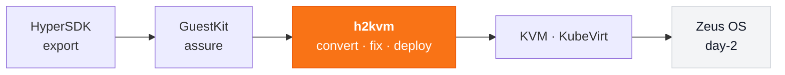

<div align="center">

# h2kvm

### Any hypervisor → KVM. Convert offline. Fix the guest. Deploy with confidence.

Export, convert, and deploy VMs from **VMware, Hyper-V, Nutanix, AWS, Azure, GCP** and more —  
with offline guest fixes, a web control plane, and a Kubernetes-native operator.

**First-boot science for hypervisor exit** · day-2 on **[Zeus OS](https://zyvor.dev/zeus-os)** · part of the [Zyvor](https://zyvor.dev/?utm_source=github&utm_medium=h2kvm&utm_campaign=readme_hero) suite

<br/>

[](https://github.com/zyvorai/h2kvm/releases/tag/v1.1.0)
[](https://pypi.org/project/hypersdk-guestkit/)
[](https://www.python.org/)
[](https://github.com/zyvorai/h2kvm/stargazers)

<br/>

[](https://zyvor.dev/contact?intent=demo&utm_source=github&utm_medium=h2kvm&utm_campaign=readme_hero)
[](https://zyvor.dev/poc?utm_source=github&utm_medium=h2kvm&utm_campaign=readme_hero)
[](https://www.youtube.com/watch?v=lQP1sd5Ftkc)

**[Quick start](#60-second-quick-start)** ·
**[GuestKit](#guestkit-integration)** ·
**[Remote deploy](#remote-lab-deploy)** ·
**[Demos](#see-it-in-action)** ·
**[CE vs Enterprise](#community-vs-enterprise)** ·
**[Docs](docs/README.md)** ·
**[Product](https://zyvor.dev/h2kvm?utm_source=github&utm_medium=h2kvm)**

</div>

---

## The cutover problem — fixed before power-on

Hypervisor exit fails when VirtIO is missing, GRUB is wrong, or Windows registry still points at the old hypervisor — **after** you cut over.

**h2kvm converts the disk offline, injects drivers, and deploys to libvirt / KubeVirt / OpenStack** so first boot is a plan, not a prayer.

```text
  VMware · Hyper-V · cloud disks · …
              │
              ▼
  ┌─────────────────────────────────┐
  │  h2kvm                      │──►  convert → qcow2 / raw
  │  h2kvmctl · h2kweb · zkvm       │──►  GuestKit offline inspect + repair
  │  K8s / OLM operator             │──►  deploy · validate · rollback
  └─────────────────────────────────┘
              │
              ▼
       libvirt · KubeVirt · OpenShift · Glance/Nova
              │
              ▼
            Zeus OS (day-2)
```

| | | | |
|:---:|:---:|:---:|:---:|
| **GuestKit** offline fix | **8+** input formats | **35+** guest OS | **1390+** tests |
| CLI · h2kweb · zkvm | K8s operator | Windows path | **10K+** PyPI downloads |

**Export with [HyperSDK](https://github.com/hypersdk/hypersdk) → assure with [GuestKit](https://github.com/hypersdk/guestkit) → convert & deploy with h2kvm → operate on [Zeus OS](https://zyvor.dev/zeus-os).**

---

## GuestKit integration

Offline inspect and repair run through **[GuestKit](https://github.com/hypersdk/guestkit)** (`hypersdk-guestkit>=1.1.0`) — not a pure-Python fix engine. h2kvm delegates fstab, GRUB, initramfs, and hypervisor-aware fixes to `guestkit.run_migrate_repair()`.

```bash
pip install "hypersdk-guestkit>=1.1.0"
# h2kvm 1.1.0 — GitHub Release wheel (PyPI project pending)
pip install https://github.com/zyvorai/h2kvm/releases/download/v1.1.0/h2kvm-1.1.0-py3-none-any.whl
# or: git clone https://github.com/zyvorai/h2kvm.git && pip install '.[full]'

# VMDK → qcow2 with GuestKit offline repair (default backend)
h2kvmctl local --vmdk ubuntu.vmdk --to-output ubuntu.qcow2 --backend guestkit

# Pre-flight bootability (GuestKit CLI or Python)
guestkit doctor ubuntu.vmdk --target kvm --explain
```

```python
from h2kvm.core import guestkit_client

report = guestkit_client.doctor("ubuntu.qcow2", target="kvm", explain=True)
result = guestkit_client.migrate_repair("ubuntu.qcow2", target="kvm", apply=True)
```

| Doc | Description |
|-----|-------------|
| [GuestKit architecture](docs/architecture/GUESTKIT.md) | Backend wiring, permissions, libvirt ownership |
| [GuestKit API](docs/reference/api/guestkit.md) | Python facade + assurance APIs |
| [GuestKit repo](https://github.com/hypersdk/guestkit) | Doctor, Passport, fleet tools |

**libvirt note (Debian/Ubuntu):** after convert, `chown libvirt-qemu:kvm` on output qcow2 before `virsh start`. See [troubleshooting](docs/guides/troubleshooting.md#permissions-and-ownership).

---

## Remote lab deploy

Deploy h2kvm + system deps + h2kweb to a Linux host over SSH:

```bash
./scripts/deploy-remote.sh 175.110.122.71 sus --keep-sources

# GuestKit CLI (separate repo)
cd /path/to/guestkit
GUESTKIT_ZYVOR_ACCEPT=1 ./scripts/deploy-remote.sh 175.110.122.71 sus --quick --key
```

GuestKit **1.1.0** installs from PyPI during deploy. Full guide: **[docs/deployment/deploy-remote.md](docs/deployment/deploy-remote.md)**.

```bash
# End-to-end demo on target (osboxes Ubuntu VMDK)
sudo bash ~/.deployments/h2kvm/scripts/demo-libvirt.sh \
  ~/demo/ubuntu2404.vmdk ubuntu-test --memory 4096 --vcpus 2
```

---

## See it in action

<table>
<tr>
<td width="50%" align="center">
<a href="https://www.youtube.com/watch?v=lQP1sd5Ftkc">

<br><b>▶ Live console tour</b>
</a>
<br><sub>h2kweb — progress, migrate, deploy</sub>
</td>
<td width="50%" align="center">
<a href="https://www.youtube.com/watch?v=SF8N7gFPS0Q">

<br><b>▶ Full tutorial</b>
</a>
<br><sub>End-to-end conversion walkthrough</sub>
</td>
</tr>
<tr>
<td width="50%" align="center">
<a href="https://www.youtube.com/watch?v=etel7HPgm-U">

<br><b>▶ Feature deep dive</b>
</a>
<br><sub>Offline fix · Windows · targets</sub>
</td>
<td width="50%" align="center">
<a href="https://zyvor.dev/h2kvm?utm_source=github&utm_medium=h2kvm&utm_campaign=readme_demos">

<br><b>▶ Product page</b>
</a>
<br><sub>Architecture · editions · PoC</sub>
</td>
</tr>
</table>

<p align="center">
  Recorded against real deployments — <a href="https://zyvor.dev/demo?utm_source=github&utm_medium=h2kvm"><b>more demos →</b></a>
</p>

---

## Why teams switch

| Before h2kvm | With h2kvm |
|------------------|----------------|
| 18-month “migration project” | One pipeline: browse → migrate → deploy |
| Guest drivers break on first KVM boot | **GuestKit** offline fix for 35+ OS versions |
| Windows needs a war room of tribal scripts | Automated VirtIO / hivex / RDP path |
| No visibility mid-conversion | **h2kweb** progress · webhooks · email |
| K8s teams stuck on libvirt YAML | Libvirt → **KubeVirt** one-click path |
| Cutover outcomes unowned | Enterprise: **96.8%** automated first-boot + PS |

---

## 60-second quick start

```bash
pip install "hypersdk-guestkit>=1.1.0"
pip install https://github.com/zyvorai/h2kvm/releases/download/v1.1.0/h2kvm-1.1.0-py3-none-any.whl

# CLI migration
h2kvmctl migrate --source vmware --vm web-prod-01 --target kvm

# Web dashboard
h2kweb
# → https://localhost:5070

# Kubernetes operator
kubectl apply -f operator/deploy/
```

| Surface | What you get |
|---------|----------------|
| **CLI** | `h2kvmctl` / `h2k` — `bin/`, `h2kvm/` |
| **Web** | h2kweb dashboard — `web/` |
| **TUI** | zkvm terminal UI |
| **Operator** | K8s / OpenShift — `operator/`, `olm/` |
| **Helm** | Production charts — `helm/` |
| **Fix engine** | Offline guest OS repairs — **GuestKit** (`run_migrate_repair`) + h2kvm injectors |

| You want… | Go here |
|-----------|---------|
| Full command reference | [docs/README.md](docs/README.md) |
| Remote SSH deploy | [docs/deployment/deploy-remote.md](docs/deployment/deploy-remote.md) |
| GuestKit integration | [docs/architecture/GUESTKIT.md](docs/architecture/GUESTKIT.md) |
| Examples | [examples/](examples/) |
| CE vs Enterprise matrix | [docs/ce-vs-enterprise.md](docs/ce-vs-enterprise.md) |
| User stories | [docs/USER_STORIES.md](docs/USER_STORIES.md) |

---

## Community vs Enterprise

**Community proves convert. Enterprise owns cutover night.**

CE is for labs and single-cluster PoC. Moving a Windows estate, SAN-backed waves, or multi-site fleets? No war-room, no HA fabric, no LTS/CVE contract on CE. **Buy Enterprise.**

| | Community / public CE *(this repo)* | **[Enterprise](https://zyvor.dev/h2kvm?utm_source=github&utm_medium=h2kvm)** |
|---|---|---|
| **Who it is for** | Labs · DIY pipelines | Migration leads · **multi-wave cutovers** |
| **Convert + GuestKit offline fix** | ✅ | ✅ + validated fleet playbooks |
| **CLI · h2kweb · zkvm · operator** | ✅ Eval / single-cluster | ✅ **HA** · multi-namespace tenancy |
| **Windows path** | Automated VirtIO / registry | ✅ + **war-room / PS runbooks** |
| **Storage pipelines** | Local / libvirt / KubeVirt / Glance | ✅ + **SAN / Ceph / NetApp** |
| **Pre-flight** | GuestKit planner | ✅ + **GuestKit fleet risk scoring** |
| **First-boot** | Strong offline fix | **96.8%** automated path + PS |
| **Support** | Community | **SLA · LTS · CVE** · hypervisor-exit programs |
| **Day-2** | Hand off to **Zeus OS** | ✅ Licensed suite path |

### Why teams upgrade

1. A lab operator is not a multi-wave cutover fabric  
2. Windows estates need war-room playbooks — VirtIO alone is not enough  
3. Production needs HA, tenancy, and CVE/LTS under contract  
4. Storage teams need SAN/Ceph pipelines with a named owner  
5. You want Zyvor accountable for first-boot — not Issues at 2 a.m.  

**[Full feature matrix →](docs/ce-vs-enterprise.md)**

<div align="center">
<br/>

**Bring us your worst wave.** 30-day PoC on your estate.

[](https://zyvor.dev/poc?utm_source=github&utm_medium=h2kvm&utm_campaign=readme_footer)
[](https://zyvor.dev/contact?intent=demo&utm_source=github&utm_medium=h2kvm&utm_campaign=readme_footer)
[](https://zyvor.dev/pricing?utm_source=github&utm_medium=h2kvm&utm_campaign=readme_footer)

</div>

---

## Where this fits: the Zyvor suite



| Product | Role |
|---------|------|
| [HyperSDK](https://github.com/hypersdk/hypersdk) | Multi-cloud / vSphere · Nutanix export |
| [GuestKit](https://github.com/hypersdk/guestkit) | Offline disk doctor + Passport + `run_migrate_repair` |
| **h2kvm** *(this repo)* | Convert + GuestKit offline fix + libvirt/KubeVirt deploy |
| [Zeus OS](https://zyvor.dev/zeus-os) | Day-2 KubeVirt / cloud control plane |
| [Machina](https://zyvor.dev/machina) | Physical hypervisor OS (libvirt/KVM) |
| [PacketWolf](https://zyvor.dev/packetwolf) | Kernel-native network intelligence |

→ [zyvor.dev](https://zyvor.dev) · [hypervisor exit program](https://zyvor.dev/hypervisor-exit)

---

## Support the project

If h2kvm saved a cutover weekend, a ⭐ helps more teams find it.

| | |
|---|---|
| **Enterprise / PoC** | [Book a demo](https://zyvor.dev/contact?intent=demo) · [sales@zyvor.dev](mailto:sales@zyvor.dev) |
| **Community** | [GitHub Issues](https://github.com/hypersdk/h2kvm/issues) |
| **Product** | [zyvor.dev/h2kvm](https://zyvor.dev/h2kvm) |

## License

See [LICENSE](LICENSE) and `docs/legal/` for terms. Community / eval builds are for labs and integration — production fleets and SLAs are **Enterprise**.

<div align="center">
<sub>Built by <a href="https://zyvor.dev?utm_source=github&utm_medium=h2kvm&utm_campaign=readme_colophon">Zyvor AI Labs</a> · Hypervisor exit without the 2 a.m. surprise</sub>
</div>
