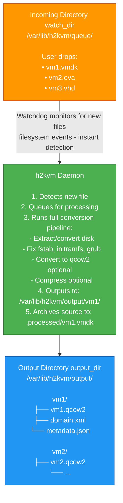

# h2kvm Daemon Mode

Comprehensive guide to running h2kvm in daemon/watch mode for automated VM conversions.

## Overview

Daemon mode monitors a directory for incoming VM disk files and automatically processes them through the conversion pipeline. This is ideal for:

- **Automated migration workflows** - Drop files in a directory, get converted VMs
- **Batch processing** - Process multiple VMs overnight without manual intervention
- **Integration pipelines** - Connect h2kvm with other tools (export → convert → deploy)
- **Production deployments** - Run as a systemd service with automatic restart

## How It Works



## Supported File Types

The daemon automatically detects file types by extension:

| Extension | Type | Handled As |
|-----------|------|------------|
| `.vmdk` | VMware disk | `command: local` |
| `.ova` | OVF archive | `command: ova` |
| `.ovf` | OVF descriptor | `command: ovf` |
| `.vhd`, `.vhdx` | Hyper-V disk | `command: vhd` |
| `.raw`, `.img` | Raw disk image | `command: raw` |
| `.ami` | AWS AMI image | `command: ami` |

## Quick Start

### 1. Create Configuration

```bash
sudo mkdir -p /etc/h2kvm

cat > /tmp/daemon.yaml <<'EOF'
command: daemon
daemon: true

# Watch directory
watch_dir: /var/lib/h2kvm/queue

# Output directory
output_dir: /var/lib/h2kvm/output

# Working directory for temporary files
workdir: /var/lib/h2kvm/work

# Conversion options
flatten: true
out_format: qcow2
compress: true
enable_recovery: true

# Guest OS fixes
fstab_mode: stabilize-all
regen_initramfs: true

# Auto-deploy to libvirt (generate XML + virsh define)
emit_domain_xml: true
virsh_define: true
memory: 2048
vcpus: 2
machine: q35

# Auto-deploy to KubeVirt (requires kubeconfig)
# deploy_k8s: true
# kubeconfig: /etc/kubernetes/admin.conf
# k8s_namespace: default

# Logging
log_file: /var/log/h2kvm/daemon.log
verbose: 1
EOF

sudo cp /tmp/daemon.yaml /etc/h2kvm/daemon.yaml
sudo chmod 640 /etc/h2kvm/daemon.yaml
```

### 2. Run Manually (Testing)

```bash
# Create directories
sudo mkdir -p /var/lib/h2kvm/{queue,output,work}
sudo mkdir -p /var/log/h2kvm

# Run daemon in foreground
sudo h2kvmctl --config /etc/h2kvm/daemon.yaml

# You should see:
# 🚀 Starting daemon mode
# 👀 Watching: /var/lib/h2kvm/queue
# 📤 Output: /var/lib/h2kvm/output
# 👂 File system observer started
# ✅ Daemon ready
```

### 3. Test File Processing

In another terminal:

```bash
# Drop a test VMDK file
sudo cp /path/to/test.vmdk /var/lib/h2kvm/queue/

# Watch the daemon logs - it should automatically:
# 📥 New file queued: test.vmdk
# 🔄 Processing: test.vmdk
# ✅ Completed: test.vmdk

# Check output
ls -lh /var/lib/h2kvm/output/test/
# Should contain: test.qcow2, domain.xml, etc.

# Source file moved to archive
ls -lh /var/lib/h2kvm/queue/.processed/
# Should contain: test.vmdk
```

## Running as Systemd Service

### Method 1: Using Template Service

```bash
# Copy config
sudo cp /tmp/daemon.yaml /etc/h2kvm/production.yaml

# Create directories
sudo mkdir -p /var/lib/h2kvm/{queue,output,work}
sudo mkdir -p /var/log/h2kvm

# Copy systemd service file
sudo cp /path/to/h2kvm/systemd/h2kvm@.service /etc/systemd/system/

# Reload systemd
sudo systemctl daemon-reload

# Start service
sudo systemctl enable --now h2kvm@production.service

# Check status
sudo systemctl status h2kvm@production.service

# View logs
sudo journalctl -u h2kvm@production.service -f
```

### Method 2: Using Main Service

```bash
# Copy config as main config
sudo cp /tmp/daemon.yaml /etc/h2kvm/h2kvm.conf

# Copy service file
sudo cp /path/to/h2kvm/systemd/h2kvm.service /etc/systemd/system/

# Start service
sudo systemctl enable --now h2kvm.service

# Check status
sudo systemctl status h2kvm.service

# View logs
sudo journalctl -u h2kvm.service -f
```

## Advanced Configuration

### Running as Dedicated User

```bash
# Create h2kvm user
sudo useradd -r -s /sbin/nologin -d /var/lib/h2kvm \
    -c "h2kvm daemon" h2kvm

# Add to required groups
for group in qemu kvm libvirt disk; do
    if getent group "$group" >/dev/null; then
        sudo usermod -a -G "$group" h2kvm
    fi
done

# Set permissions
sudo chown -R h2kvm:h2kvm /var/lib/h2kvm
sudo chown -R h2kvm:h2kvm /var/log/h2kvm
sudo chown root:h2kvm /etc/h2kvm
sudo chmod 750 /etc/h2kvm
sudo chmod 640 /etc/h2kvm/*.yaml

# Update systemd service to use h2kvm user
# (already configured in the provided service files)
```

### Running as Root (if required)

Some operations may require root (e.g., guestfs backend with certain options):

```bash
# Edit the service
sudo systemctl edit h2kvm.service

# Add:
[Service]
User=root
Group=root
ReadWritePaths=/var/lib/h2kvm /var/log/h2kvm /tmp
```

### Archive Processed Files

By default, successfully processed files are moved to `.processed/` subdirectory:

```yaml
command: daemon
daemon: true
watch_dir: /var/lib/h2kvm/queue

# After processing, files are moved to:
# /var/lib/h2kvm/queue/.processed/
```

To disable archiving, you can manually delete files from the watch directory after processing.

### Error Handling

Failed conversions are moved to `.errors/` subdirectory:

```bash
# Check failed conversions
ls -lh /var/lib/h2kvm/queue/.errors/

# View error logs
sudo journalctl -u h2kvm.service --since "1 hour ago" | grep -i error
```

## Auto-Deploy to Libvirt and KubeVirt

The daemon can automatically deploy converted VMs to libvirt and/or KubeVirt after migration. Set these in the daemon config as defaults — individual job manifests can override them.

### Libvirt Auto-Deploy

```yaml
# /etc/h2kvm/daemon.yaml
command: daemon
manifest_workflow_mode: true
manifest_workflow_dir: /var/lib/h2kvm/daemon
output_dir: /var/lib/h2kvm/output

# Auto-deploy every converted VM to libvirt
emit_domain_xml: true    # Generate domain XML
virsh_define: true       # Run virsh define (register with libvirt)
memory: 2048
vcpus: 2
machine: q35
```

After dropping a VMDK config, the daemon will:
1. Convert the VMDK to QCOW2
2. Apply offline fixes (fstab, initramfs, GRUB)
3. Generate libvirt domain XML
4. Run `virsh define` to register the VM

### KubeVirt Auto-Deploy

```yaml
# /etc/h2kvm/daemon.yaml
command: daemon
manifest_workflow_mode: true
manifest_workflow_dir: /var/lib/h2kvm/daemon
output_dir: /var/lib/h2kvm/output

# Auto-deploy to KubeVirt
deploy_k8s: true
kubeconfig: /etc/kubernetes/admin.conf   # or ~/.kube/config
k8s_namespace: default
```

The daemon sets `KUBECONFIG` from the config and deploys VMs via `kubectl apply`.

### Dual Deploy (Libvirt + KubeVirt)

```yaml
# /etc/h2kvm/daemon.yaml
command: daemon
manifest_workflow_mode: true
manifest_workflow_dir: /var/lib/h2kvm/daemon
output_dir: /var/lib/h2kvm/output

# Deploy to both targets
emit_domain_xml: true
virsh_define: true
deploy_k8s: true
kubeconfig: /etc/kubernetes/admin.conf
k8s_namespace: production

# Common settings
flatten: true
out_format: qcow2
regen_initramfs: true
fstab_mode: stabilize-all
memory: 4096
vcpus: 4
machine: q35
```

### Per-Job Override

Individual job manifests can override daemon defaults:

```yaml
# Drop into to_be_processed/big-db.yaml
cmd: local
vmdk: /exports/big-db.vmdk
memory: 32768          # Override daemon's 4096
vcpus: 16              # Override daemon's 4
deploy_k8s: false      # Skip KubeVirt for this VM
k8s_namespace: databases  # Different namespace if deploy_k8s were true
```

## Configuration Examples

### Minimal Configuration

```yaml
command: daemon
daemon: true
watch_dir: /incoming
output_dir: /output
```

### Production Configuration

```yaml
command: daemon
daemon: true

# Directories
watch_dir: /var/lib/h2kvm/queue
output_dir: /var/lib/h2kvm/output
workdir: /var/lib/h2kvm/work

# Output format
flatten: true
out_format: qcow2
compress: true
compress_level: 6

# Recovery and reliability
enable_recovery: true
checksum: true

# Performance (for large VMs)
parallel_processing: true

# Guest OS fixes
fstab_mode: stabilize-all
regen_initramfs: true
# grub is auto-handled

# Windows-specific
windows: true
win_hyperv: true

# Logging
log_file: /var/log/h2kvm/daemon.log
verbose: 2

# Domain XML generation
emit_domain_xml: true
vm_memory: 4096
vm_vcpus: 2
vm_uefi: true
```

### High-Volume Processing

```yaml
command: daemon
daemon: true

watch_dir: /var/lib/h2kvm/queue
output_dir: /mnt/storage/converted-vms
workdir: /var/lib/h2kvm/work

# Enable parallel processing
parallel_processing: true

# Skip time-consuming operations
fstab_mode: minimal
regen_initramfs: false

# Output settings
flatten: true
out_format: qcow2
compress: false  # Skip compression for speed

# Logging
verbose: 1
log_file: /var/log/h2kvm/high-volume.log
```

### Multi-Instance Setup

Run multiple daemon instances for different sources:

```bash
# vSphere migrations
cat > /etc/h2kvm/vsphere.yaml <<EOF
command: daemon
daemon: true
watch_dir: /var/lib/h2kvm/vsphere-queue
output_dir: /var/lib/h2kvm/vsphere-output
log_file: /var/log/h2kvm/vsphere.log
EOF

# Azure migrations
cat > /etc/h2kvm/azure.yaml <<EOF
command: daemon
daemon: true
watch_dir: /var/lib/h2kvm/azure-queue
output_dir: /var/lib/h2kvm/azure-output
log_file: /var/log/h2kvm/azure.log
EOF

# Hyper-V migrations
cat > /etc/h2kvm/hyperv.yaml <<EOF
command: daemon
daemon: true
watch_dir: /var/lib/h2kvm/hyperv-queue
output_dir: /var/lib/h2kvm/hyperv-output
log_file: /var/log/h2kvm/hyperv.log
EOF

# Start all instances
sudo systemctl enable --now h2kvm@vsphere.service
sudo systemctl enable --now h2kvm@azure.service
sudo systemctl enable --now h2kvm@hyperv.service
```

## Monitoring and Troubleshooting

### Check Service Status

```bash
# Service status
sudo systemctl status h2kvm.service

# Is it running?
sudo systemctl is-active h2kvm.service

# View recent logs
sudo journalctl -u h2kvm.service -n 50

# Follow logs in real-time
sudo journalctl -u h2kvm.service -f

# View logs from last hour
sudo journalctl -u h2kvm.service --since "1 hour ago"
```

### Debug Mode

```yaml
# Enable verbose logging
command: daemon
daemon: true
watch_dir: /incoming
output_dir: /output
verbose: 3  # Maximum verbosity
```

### Common Issues

#### 1. Daemon Exits Immediately

```bash
# Check logs for errors
sudo journalctl -u h2kvm.service --since "5 minutes ago"

# Common causes:
# - Missing watch_dir or output_dir
# - Permission denied
# - Invalid configuration
```

#### 2. Files Not Being Processed

```bash
# Check if daemon is watching the right directory
sudo journalctl -u h2kvm.service | grep "Watching:"

# Check file permissions
ls -lh /var/lib/h2kvm/queue/

# Check if files have supported extensions
ls -lh /var/lib/h2kvm/queue/*.{vmdk,ova,vhd,raw,img,ami}
```

#### 3. Conversions Failing

```bash
# Check error directory
ls -lh /var/lib/h2kvm/queue/.errors/

# View detailed error logs
sudo journalctl -u h2kvm.service | grep -A 20 "Failed to process"

# Check disk space
df -h /var/lib/h2kvm
```

#### 4. Permission Errors

```bash
# If running as h2kvm user, ensure proper permissions
sudo chown -R h2kvm:h2kvm /var/lib/h2kvm
sudo chown -R h2kvm:h2kvm /var/log/h2kvm

# Or run as root (edit systemd service)
sudo systemctl edit h2kvm.service
# Add: User=root, Group=root
```

## Performance Tuning

### For Large VMs (100GB+)

```yaml
command: daemon
daemon: true

# Use direct I/O
use_export: true

# Enable parallel processing
parallel_processing: true
export_concurrency: 2

# Skip compression (do later if needed)
compress: false

# Increase systemd limits
# Edit /etc/systemd/system/h2kvm.service:
# MemoryMax=16G
# CPUQuota=400%
```

### For Many Small VMs

```yaml
command: daemon
daemon: true

# Enable compression to save space
compress: true
compress_level: 6

# Parallel processing
parallel_processing: true

# Faster guest OS fixes
fstab_mode: minimal
regen_initramfs: true
```

## Integration Examples

### With vSphere Export

```bash
# Export from vSphere using h2kvmd
curl -X POST http://localhost:8080/jobs/submit -H "Content-Type: application/json" -d '{
  "vm_path": "/datacenter/vm/my-vm",
  "output_path": "/var/lib/h2kvm/queue"
}'

# h2kvm daemon automatically picks up the exported files
# and converts them to qcow2
```

### With Cron Job

```bash
# /etc/cron.d/vm-export
# Export VMs daily at 2 AM and convert them
0 2 * * * root /usr/local/bin/export-vms.sh && \
  cp /exports/*.vmdk /var/lib/h2kvm/queue/
```

### With CI/CD Pipeline

```yaml
# .gitlab-ci.yml
migrate-vms:
  stage: migrate
  script:
    - scp vm-exports/*.ova migration-server:/var/lib/h2kvm/queue/
    - ssh migration-server 'systemctl is-active h2kvm.service'
    - ./wait-for-conversion.sh
  artifacts:
    paths:
      - /var/lib/h2kvm/output/
```

## Security Considerations

### Filesystem Permissions

```bash
# Lock down config directory
sudo chmod 750 /etc/h2kvm
sudo chmod 640 /etc/h2kvm/*.yaml

# Protect work directories
sudo chmod 750 /var/lib/h2kvm
sudo chmod 750 /var/log/h2kvm
```

### Systemd Hardening

The provided service files include security hardening:

```ini
[Service]
# Security hardening
NoNewPrivileges=true
PrivateTmp=true
ProtectSystem=strict
ProtectHome=true
ReadWritePaths=/var/lib/h2kvm /var/log/h2kvm

# Resource limits
MemoryMax=8G
CPUQuota=400%
TasksMax=200
```

### Network Isolation

```bash
# If daemon doesn't need network access:
sudo systemctl edit h2kvm.service

[Service]
PrivateNetwork=true
```

## Stopping the Daemon

### Graceful Shutdown

```bash
# Stop service (waits for current job to finish)
sudo systemctl stop h2kvm.service

# Or send SIGTERM
sudo kill -TERM $(pgrep -f "h2kvm.*daemon")
```

### Force Stop

```bash
# Force stop (kills immediately)
sudo systemctl kill -s SIGKILL h2kvm.service
```

## See Also

- [YAML Configuration Examples](05-YAML-Examples.md#6-daemon-mode-watch-a-directory-and-auto-convert)
- [Systemd Service Units](../systemd/README.md)
- [h2kvm Main Documentation](../README.md)
- [Integration with hypervisord](https://github.com/ssahani/hypersdk)
