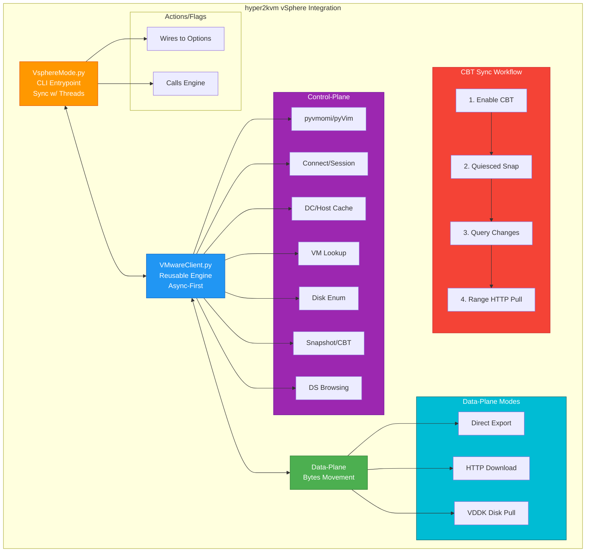
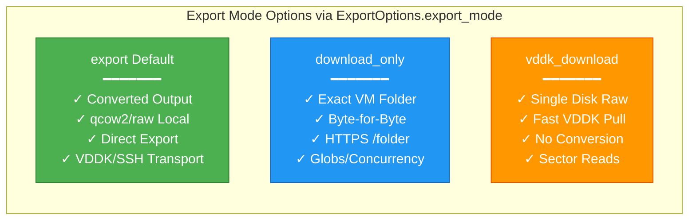
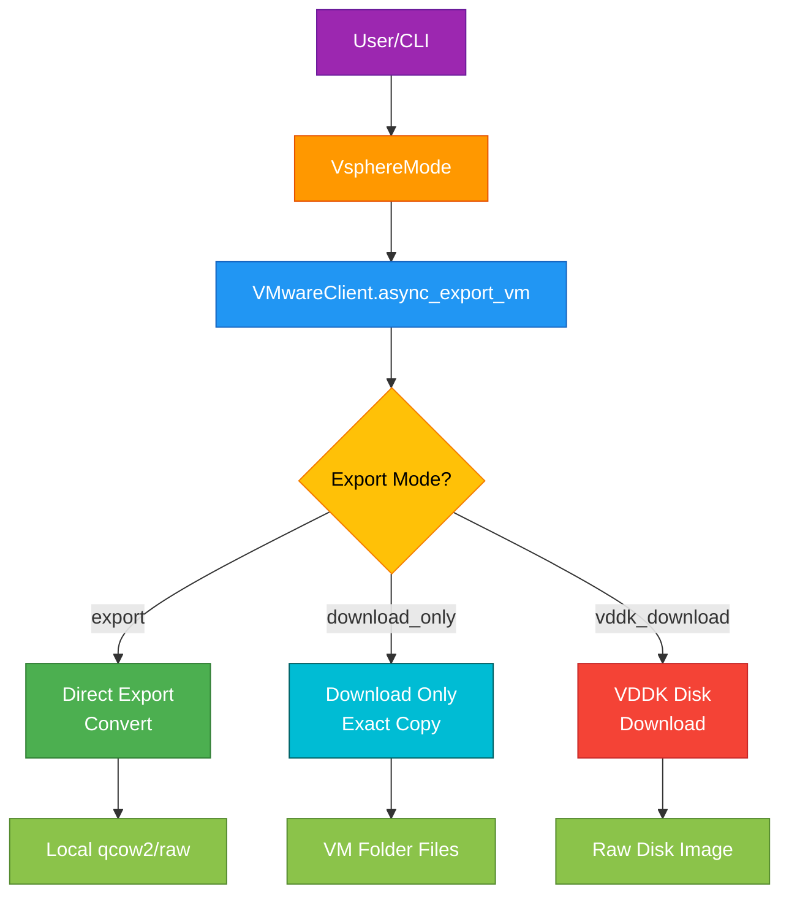

# hyper2kvm: vSphere Control-Plane + Data-Plane Design

> **VMware API Integration**: hyper2kvm leverages **hypersdk** (VMware's modern Python SDK, formerly known as pyvmomi/pyVmomi) for enterprise-grade, type-safe vCenter/vSphere API access.

## Table of Contents

- [Prerequisites](#prerequisites)
- [Overview](#overview)
- [Design Principles](#design-principles)
  - [Control-Plane ≠ Data-Plane (Don’t Mix Them)](#control-plane-data-plane-dont-mix-them)
  - [Don’t Scan the Universe Unless Asked](#dont-scan-the-universe-unless-asked)
  - [Correct Compute Paths for Libvirt ESX (Host-System Path)](#correct-compute-paths-for-libvirt-esx-host-system-path)
  - [Bytes Should Be Explicit (Download ≠ Convert)](#bytes-should-be-explicit-download-convert)
  - [Async Where It Matters, Sync Where It’s Safe](#async-where-it-matters-sync-where-its-safe)
  - [Never Hide the Real Failure](#never-hide-the-real-failure)
- [Architecture Diagram](#architecture-diagram)
  - [Philosophy & Design Principles](#philosophy-design-principles)
  - [Main Architecture Components](#main-architecture-components)
  - [Export Modes](#export-modes)
  - [Export Flow](#export-flow)
- [Detailed Architecture Breakdown](#detailed-architecture-breakdown)
  - [Where pyvmomi Ends and Data-Plane Begins](#where-pyvmomi-ends-and-data-plane-begins)
    - [Control-Plane: pyvmomi / pyVim in `hyper2kvm`](#control-plane-pyvmomi-pyvim-in-hyper2kvm)
    - [Data-Plane Options in `hyper2kvm`](#data-plane-options-in-hyper2kvm)
  - [Why There Are *Two* Download-Only Implementations (Engine + CLI)](#why-there-are-two-download-only-implementations-engine-cli)
- [CBT Sync in `hyper2kvm` (Control-Plane + Data-Plane Hybrid)](#cbt-sync-in-hyper2kvm-control-plane-data-plane-hybrid)
- [Encoding + Typing Choices Used Across `hyper2kvm`](#encoding-typing-choices-used-across-hyper2kvm)
- [Mode Selection Cheatsheet (for `hyper2kvm`)](#mode-selection-cheatsheet-for-hyper2kvm)
- [Usage Examples](#usage-examples)
  - [Example 1: Basic VM Export](#example-1-basic-vm-export)
  - [Example 2: Download-Only Mode](#example-2-download-only-mode)
  - [Example 3: VDDK Fast Transfer](#example-3-vddk-fast-transfer)
  - [Example 4: Programmatic Usage](#example-4-programmatic-usage)
- [Enhancements & Best Practices](#enhancements-best-practices)
- [Next Steps](#next-steps)
- [Getting Help](#getting-help)

---

## Prerequisites

Before following this guide, you should have:

- ✓ Completed the [Installation](02-Installation.md)
- ✓ Familiarity with basic hyper2kvm concepts
- ✓ Root/sudo access to your system
- ✓ Source VM files ready for migration

## Overview
`hyper2kvm` is a specialized tool for integrating with VMware vSphere, treating it in a realistic manner: **inventory and orchestration exist in one domain**, while **disk byte movement operates in another**. This intentional separation ensures the vSphere integration remains fast, predictable, and highly debuggable. By avoiding the mixing of control-plane and data-plane operations, the tool prevents common pitfalls like performance bottlenecks in large inventories or hidden failures during exports.

The philosophy is embodied in two key files:
- **`hyper2kvm/vsphere/vmware_client.py`**: The reusable engine, designed async-first for multi-mode exports (e.g., conversion, downloads).
- **`hyper2kvm/vsphere/<vsphere_cli_entry>.py` (VsphereMode)**: The action-driven CLI entrypoint, which orchestrates user commands and delegates to the engine.

This structure allows for modular reuse: the engine can be imported independently for scripting, while the CLI provides a user-friendly interface.

## Design Principles
The core principles guide the tool's behavior to address real-world vSphere challenges:

### Control-Plane ≠ Data-Plane (Don't Mix Them)
- **Control-Plane** (powered by **hypersdk**, VMware's modern Python SDK - `pyvmomi` / `pyVim` / `pyVmomi`): Handles resolution of inventory objects, datacenters, hosts, snapshots, Changed Block Tracking (CBT), and datastore browsing with enterprise-grade, type-safe API access.
- **Data-Plane** (using HTTPS `/folder` / VDDK): Focuses solely on moving bytes, such as exporting/converting disks or downloading VM folders.
In `hyper2kvm`, **hypersdk** is strictly used to *find and describe* resources (e.g., locating a VM or disk), after which a dedicated data-plane mechanism takes over for efficient byte transfer. This prevents overhead from blending discovery with heavy I/O operations.

### Don’t Scan the Universe Unless Asked
vCenter inventories can be massive, and naive "list everything" approaches lead to sluggish tools. To counter this:
- `VMwareClient` makes inventory printing **opt-in** via `print_vm_names`.
- Caching is applied to small, stable lists like datacenters and hosts for quick access.
- Targeted lookups (e.g., `get_vm_by_name`) are prioritized over repeated `CreateContainerView` traversals, ensuring operations scale well in enterprise environments.

### Correct Compute Paths for Libvirt ESX (Host-System Path)
`hyper2kvm` resolves a common failure where libvirt rejects cluster-only paths:
- Avoid: `host/<cluster>`  (frequently rejected).
- Resolve to: `host/<cluster-or-compute>/<esx-host>` , or fallback to `host/<esx-host>` .
This fix prevents errors like **"Path … does not specify a host system"** when constructing `vpx://...` URIs.

### Bytes Should Be Explicit (Download ≠ Convert)
Operators need control over operations to avoid surprises. `hyper2kvm` exposes distinct data-plane modes:
- **Direct Export**: Converts to local `qcow2/raw` formats, potentially inspecting/modifying the guest.
- **HTTP Download-Only**: Pulls exact byte-for-byte VM folder files (e.g., VMDKs, VMX).
- **VDDK Single-Disk Pull**: Raw extraction of one disk via VDDK, without conversion.
No "download" mode accidentally mutates guests—transparency is key.

### Async Where It Matters, Sync Where It's Safe
- `VMwareClient` is async-first, leveraging `asyncio` for benefits in downloads and subprocess log streaming.
- `VsphereMode` remains synchronous but incorporates concurrency via `ThreadPoolExecutor` for parallel tasks like file downloads.

### Never Hide the Real Failure
vSphere failures often involve cryptic issues (e.g., TLS mismatches, invalid thumbprints, path errors, or verbose stderr). `vmware_client.py` addresses this with:
- Stderr tail capture to expose the *actual* root cause in logs/errors.
- Chunk-based stream pumping to prevent `asyncio LimitOverrunError` from tools emitting excessively long lines without newlines.

## Architecture Diagram

### Philosophy & Design Principles

The vSphere integration follows these core principles:
- **Control-Plane ≠ Data-Plane**: Inventory/orchestration separate from byte movement
- **Fast, Predictable, Debuggable**: No performance bottlenecks
- **No Universe Scans Unless Opt-In**: Targeted lookups, not full inventory traversals
- **Correct Paths for libvirt ESX**: `host/<cluster>/<esx-host>` format
- **Explicit Modes**: Download ≠ Convert (transparency)
- **Async-First Engine + Sync CLI**: Concurrency where it matters
- **Never Hide Failures**: Stderr tail capture, chunked stream pumping

### Main Architecture Components



### Export Modes



### Export Flow



## Detailed Architecture Breakdown
### Where pyvmomi Ends and Data-Plane Begins
#### Control-Plane: pyvmomi / pyVim in `hyper2kvm`
The control-plane leverages `pyvmomi` for non-I/O tasks:
- **Connection + Session Management**: Utilizes `SmartConnect` for establishing connections and retrieving session cookies.
- **Datacenter + Host Discovery**: Caches lists via container views.
- **VM Lookup (by Name)**: Efficient targeted searches.
- **Disk Enumeration + Selection**: Lists virtual disks and selects by index or label.
- **Snapshot + CBT Orchestration**: Creates snapshots, enables CBT, and queries changes.
- **Datastore Browsing**: Lists files in VM folders using browser tasks.

Key Patterns:
- `si.RetrieveContent()` → `content` for root access.
- `CreateContainerView` for scoped views of VMs/hosts/datacenters.
- Property collector in CLI for bulk reads in `list_vm_names`.
- Datastore browser tasks like `SearchDatastore_Task` and `SearchDatastoreSubFolders_Task` for directory listings.

#### Data-Plane Options in `hyper2kvm`
1. **Direct Export Mode (`export_mode="export"`)**:
   - Implemented in `VMwareClient`.
   - Builds correct paths for disk access.
   - Validates/resolves `vddk-libdir` for VDDK transport.
   - Streams subprocess output safely with chunking.
   - Emits local output to `output_dir`.
   - This is the primary "conversion/export" path, supporting transports like `vddk` or `ssh`.

2. **HTTP `/folder` Download-Only Mode (`export_mode="download_only"`)**:
   - Used in both engine and CLI.
   - Mechanics: vCenter exposes `https://<vc>/folder/<ds_path>?dcPath=<dc>&dsName=<ds>`.
   - Authentication via session cookie from `pyvmomi` (`si._stub.cookie`).
   - `ds_path` is URL-encoded with slashes preserved (`quote(..., safe="/")`).
   - In `VMwareClient`: Async downloads with `aiohttp + aiofiles` (if available), controlled concurrency via `download_only_concurrency`, and globs/max files for safety.
   - In `VsphereMode`: File listing via datastore browser, parallel downloads with `ThreadPoolExecutor`, mirrors layout under `--output-dir`.
   - This provides a "byte-for-byte VM directory pull" without guest inspection.

3. **VDDK Single-Disk Pull (`export_mode="vddk_download"`)**:
   - Implemented in `VMwareClient`.
   - Control-plane resolves runtime ESXi host and disk backing filename (`[ds] folder/disk.vmdk`).
   - Data-plane uses `VDDKESXClient` for sector downloads to local files.
   - Handles: `vddk-libdir` validation (must contain `libvixDiskLib.so`), thumbprint normalization/auto-computation (unless `no_verify`), rate-limited progress logging.
   - This is the "get one disk fast, don’t convert" path.

### Why There Are *Two* Download-Only Implementations (Engine + CLI)
Currently, `hyper2kvm` features dual implementations for download-only:
- `VMwareClient.async_download_only_vm()`: Async, with globs, concurrency, and reuse focus.
- `VsphereMode` action `download_only_vm`: Sync with thread pool, CLI-oriented.
This duplication is temporary for behavior stabilization. Long-term plan:
- CLI (`VsphereMode`) becomes a thin layer.
- Delegates to `VMwareClient.export_vm(ExportOptions(export_mode="download_only", ...))`.
- Engine owns correctness, retries, and async HTTP; CLI handles flag mapping.

## CBT Sync in `hyper2kvm` (Control-Plane + Data-Plane Hybrid)
`cbt_sync` exemplifies the split's value for incremental workflows:
**Control-Plane Steps:**
1. Optionally enable CBT.
2. Create a quiesced snapshot.
3. Query changed disk areas via `QueryChangedDiskAreas(...)`.

**Data-Plane Step:**
4. For each changed extent, fetch byte ranges using HTTP Range requests (`Range: bytes=<start>-<end>`) and write to local disk at the offset.
This transforms vSphere into an efficient incremental block source, avoiding full disk re-downloads.

## Encoding + Typing Choices Used Across `hyper2kvm`
- `# -*- coding: utf-8 -*-`: Ensures safe handling of logs and VM names in diverse environments.
- `from __future__ import annotations`: Mitigates runtime type-evaluation issues and simplifies optional imports.

## Mode Selection Cheatsheet (for `hyper2kvm`)
| Need | Mode | Transport/Details |
|------|------|-------------------|
| **Converted qcow2/raw** | `export_mode="export"` | `vddk` or `ssh` |
| **Exact VM folder contents from datastore** | `export_mode="download_only"` | HTTP `/folder` |
| **One disk as raw bytes via VDDK** | `export_mode="vddk_download"` | VDDK client |
| **Incremental updates on local disk** | `cbt_sync` | CBT + ranged HTTP reads |

## Usage Examples

### Example 1: Basic VM Export

```bash
# Export VM
h2kvmctl vsphere \
  --vcenter vcenter.example.com \
  --username admin@vsphere.local \
  --password-file ~/.vcenter_pass \
  --vs-action export-vm \
  --vs-vm-name production-web \
  --output-dir /data/exports
```

### Example 2: Download-Only Mode

```bash
# Download exact VM folder contents
h2kvmctl vsphere \
  --vcenter vcenter.example.com \
  --username admin \
  --vs-action download-vm \
  --vs-vm-name backup-server \
  --output-dir /backups
```

### Example 3: VDDK Fast Transfer

```bash
# Use VDDK for high-speed transfer
h2kvmctl vsphere \
  --vcenter vcenter.example.com \
  --username admin \
  --vs-action vddk-export \
  --vs-vm-name database-01 \
  --vddk-libdir /usr/lib/vmware-vix-disklib \
  --output-dir /data/vms
```

### Example 4: Programmatic Usage

```python
from hyper2kvm.vmware.clients.client import VMwareClient
from hyper2kvm.vmware.vsphere.mode import ExportOptions

# Initialize client
client = VMwareClient(
    host='vcenter.example.com',
    user='admin@vsphere.local',
    pwd='password'
)

# Configure export
options = ExportOptions(
    vm_name='web-server',
    output_dir='/data/exports',
    export_mode='export',
    transport='vddk',
    vddk_libdir='/usr/lib/vmware-vix-disklib'
)

# Execute export
await client.async_export_vm(options)
```


## Enhancements & Best Practices
- **Error Handling**: Integrates stderr tails for diagnostics; detects transient issues (e.g., connection resets, auth failures).
- **Performance Tips**: Enable `prefer_cached_vm_lookup` for repetitive tasks; tune `download_only_concurrency` to balance load.
- **Security**: Supports `no_verify` but auto-computes thumbprints; passwords use secure temp files.
- **Extensibility**: `ExportOptions` dataclass for easy customization; add `extra_args` for export processing.
- **Future Directions**: Full consolidation of download logic; multi-disk CBT expansions; enhanced retry mechanisms.

For code-level details, see `vmware_client.py`. If further expansions or examples are needed, provide specifics!

## Next Steps

Continue your migration journey:

- **[CLI Reference](04-CLI-Reference.md)** - Complete command options
- **[YAML Examples](05-YAML-Examples.md)** - Configuration templates
- **[Cookbook](06-Cookbook.md)** - Common scenarios
- **[Troubleshooting](90-Failure-Modes.md)** - When things go wrong

## Getting Help

Found an issue? [Report it on GitHub](https://github.com/ssahani/hyper2kvm/issues)

