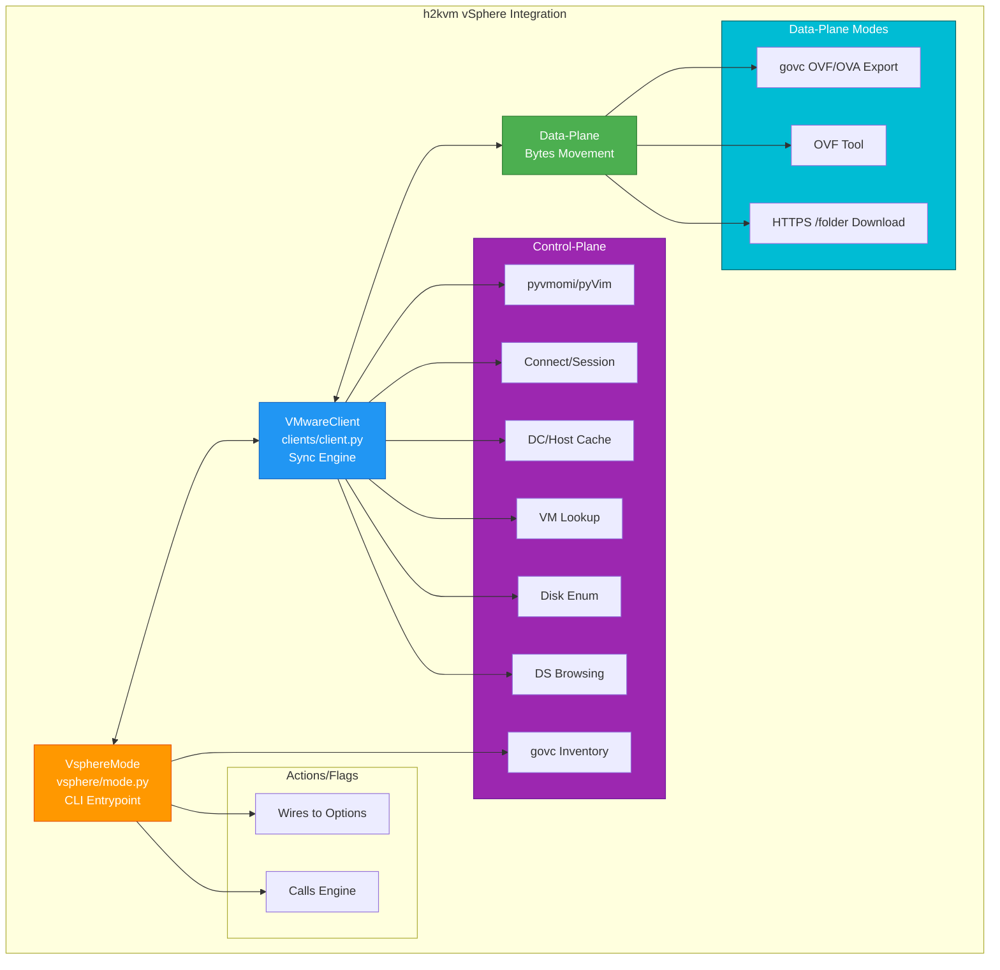
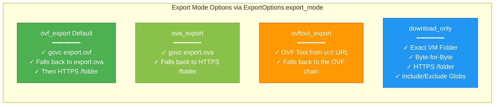
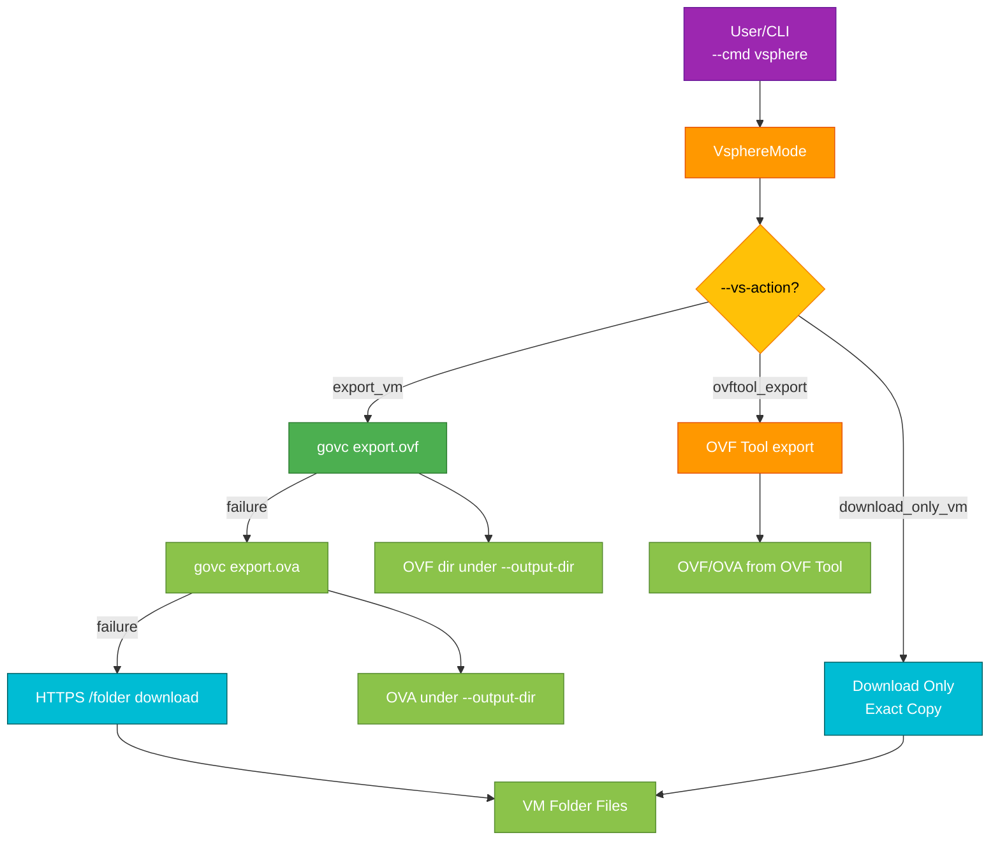

# h2kvm: vSphere Control-Plane + Data-Plane Design

> **VMware API Integration**: h2kvm uses **pyvmomi** (VMware's Python SDK for the vSphere API, imported as `pyVmomi` / `pyVim`) for vCenter/ESXi inventory access, and `govc`, OVF Tool and HTTPS `/folder` for moving bytes.

## Table of Contents

- [Prerequisites](#prerequisites)
- [Overview](#overview)
- [Design Principles](#design-principles)
  - [Control-Plane ≠ Data-Plane (Don’t Mix Them)](#control-plane--data-plane-dont-mix-them)
  - [Don’t Scan the Universe Unless Asked](#dont-scan-the-universe-unless-asked)
  - [Correct Compute Paths (Host-System Path)](#correct-compute-paths-host-system-path)
  - [Bytes Should Be Explicit (Download ≠ Convert)](#bytes-should-be-explicit-download--convert)
  - [Synchronous Client, Threads Only Where Used](#synchronous-client-threads-only-where-used)
  - [Never Hide the Real Failure](#never-hide-the-real-failure)
- [Architecture Diagram](#architecture-diagram)
  - [Philosophy & Design Principles](#philosophy--design-principles)
  - [Main Architecture Components](#main-architecture-components)
  - [Export Modes](#export-modes)
  - [Export Flow](#export-flow)
- [Detailed Architecture Breakdown](#detailed-architecture-breakdown)
  - [Where pyvmomi Ends and Data-Plane Begins](#where-pyvmomi-ends-and-data-plane-begins)
    - [Control-Plane: pyvmomi / pyVim and govc in `h2kvm`](#control-plane-pyvmomi--pyvim-and-govc-in-h2kvm)
    - [Data-Plane Options in `h2kvm`](#data-plane-options-in-h2kvm)
  - [Why There Are *Two* Download-Only Implementations (Engine + CLI)](#why-there-are-two-download-only-implementations-engine--cli)
- [Supported vSphere Actions](#supported-vsphere-actions)
- [Typing Choices Used in the vSphere Modules](#typing-choices-used-in-the-vsphere-modules)
- [Mode Selection Cheatsheet (for `h2kvm`)](#mode-selection-cheatsheet-for-h2kvm)
- [Usage Examples](#usage-examples)
  - [Example 1: Basic VM Export](#example-1-basic-vm-export)
  - [Example 2: Download-Only Mode](#example-2-download-only-mode)
  - [Example 3: Programmatic Usage](#example-3-programmatic-usage)
- [Enhancements & Best Practices](#enhancements--best-practices)
- [Next Steps](#next-steps)
- [Getting Help](#getting-help)

---

## Prerequisites

Before following this guide, you should have:

- ✓ Completed the [Installation](../getting-started/01-Installation.md)
- ✓ Familiarity with basic h2kvm concepts
- ✓ Root/sudo access to your system
- ✓ `pyvmomi` installed (`pip install pyvmomi`) and, for the `list_vm_names`, `export_vm` and `download_only_vm` actions, `govc` on `PATH`
- ✓ Network access and credentials for the vCenter/ESXi host you are migrating from

## Overview
`h2kvm` integrates with VMware vSphere by keeping two concerns apart: **inventory and orchestration exist in one domain**, while **disk byte movement operates in another**. This intentional separation keeps the vSphere integration fast, predictable, and debuggable. By avoiding the mixing of control-plane and data-plane operations, the tool prevents common pitfalls like slow lookups in large inventories or hidden failures during exports.

The integration lives in three places:
- **`h2kvm/providers/vmware/clients/client.py`**: `VMwareClient`, the reusable synchronous engine (connect, inventory lookups, export chain, download-only), and the `ExportOptions` dataclass that configures it.
- **`h2kvm/providers/vmware/vsphere/mode.py`**: `VsphereMode`, the action-driven CLI entrypoint for `--cmd vsphere`. It orchestrates user commands and delegates to `VMwareClient`, `govc` and the transports.
- **`h2kvm/orchestration/vsphere_exporter.py`**: `VsphereExporter`, the multi-VM `--vs-export` path that drives `VMwareClient.export_vm(ExportOptions(...))`, plus `find_exported_disks()`, which locates the disk images an export left behind.

The data-plane transports live in `h2kvm/providers/vmware/transports/`:
- `govc_export.py` (with `govc_common.py`): `govc export.ovf` / `export.ova` workflow.
- `ovftool_loader.py` (with `ovftool_client.py`): OVF Tool export/deploy.
- `http_client.py`: HTTPS `/folder` downloads (`HTTPDownloadClient`).

Datastore and inventory helpers used by `VMwareClient` are in `h2kvm/providers/vmware/utils/datastore.py`.

This structure allows for modular reuse: the client can be imported independently for scripting, while the CLI provides a user-friendly interface.

## Design Principles
The core principles guide the tool's behavior to address real-world vSphere challenges:

### Control-Plane ≠ Data-Plane (Don't Mix Them)
- **Control-Plane** (`pyvmomi` / `pyVim`, plus `govc` for inventory listing): Handles resolution of inventory objects (datacenters, hosts, VMs), disk lookup, and datastore browsing.
- **Data-Plane** (HTTPS `/folder`, `govc export`, or `ovftool`): Focuses solely on moving bytes, such as exporting a VM as OVF/OVA or downloading VM folders.
In `h2kvm`, **pyvmomi** and **govc** are used to *find and describe* resources (e.g., locating a VM or listing its datastore folder), after which a dedicated data-plane mechanism takes over for byte transfer. This prevents overhead from blending discovery with heavy I/O operations.

### Don’t Scan the Universe Unless Asked
vCenter inventories can be massive, and naive "list everything" approaches lead to sluggish tools. To counter this:
- `VMwareClient` does not enumerate the inventory on connect; listing VMs is an explicit action (`--vs-action list_vm_names`).
- Datacenter and host name lists are cached on the client (`list_datacenters`, `list_host_names`), and `get_vm_by_name` caches each VM object it resolves, so repeated lookups of the same VM do not re-walk the inventory.
- `list_vm_names` switches to a names-only listing when the inventory exceeds `--govc-max-detail` VMs, instead of fetching per-VM details.

### Correct Compute Paths (Host-System Path)
`h2kvm` resolves the compute path for a VM instead of relying on a cluster-only path:
- Avoid: `host/<cluster>`.
- Resolve to: `host/<cluster-or-compute>/<esx-host>`, or fall back to `host/<esx-host>` when the host has no distinct parent name.
`VMwareClient.resolve_host_system_for_vm()` builds this from the VM's runtime host, and `resolve_compute_for_vm()` honors an explicit `ExportOptions.compute` value (`"auto"` by default).

### Bytes Should Be Explicit (Download ≠ Convert)
Operators need control over operations to avoid surprises. `h2kvm` exposes distinct data-plane modes:
- **Export (OVF/OVA)**: `govc export.ovf` / `export.ova` writes an OVF directory or OVA into the output directory, falling back to an HTTPS `/folder` download if both fail. Conversion to qcow2/raw happens later in the pipeline, not in the download step.
- **OVF Tool export**: `ovftool` pulls the VM from a `vi://` source URL.
- **HTTP Download-Only**: Pulls exact byte-for-byte VM folder files (e.g., VMDKs, VMX).
No "download" mode accidentally mutates guests—transparency is key.

### Synchronous Client, Threads Only Where Used
- `VMwareClient` and `VsphereMode` are synchronous: pyvmomi calls, `govc`/`ovftool` subprocesses and `requests`-based HTTP downloads all block the caller.
- The shared HTTP layer (`HTTPDownloadManager` in `transports/http_client.py`) can fan downloads out over a `ThreadPoolExecutor` when `max_workers` is greater than 1.
- The `VsphereMode` `download_only_vm` action currently downloads its files one at a time; the `--concurrency` and `--use-async-http` options are parsed but not consumed by that action.

### Never Hide the Real Failure
vSphere failures often involve cryptic issues (e.g., TLS mismatches, path errors, or verbose stderr). h2kvm addresses this with:
- `govc_export.py` streams govc output live, splitting on both `\n` and `\r` so progress lines are visible, and on a non-zero exit it includes the last 40 output lines in the error along with hints for common causes (expired export lease, missing object, etc.).
- `VsphereMode.run()` adds targeted hints to connection failures (TLS/certificate errors suggest `--vc-insecure`; refused/timeout errors suggest checking host and port 443; auth errors suggest checking the vCenter credentials).
- `VMwareClient.connect()` retries transient connection errors with exponential backoff before giving up.

## Architecture Diagram

### Philosophy & Design Principles

The vSphere integration follows these core principles:
- **Control-Plane ≠ Data-Plane**: Inventory/orchestration separate from byte movement
- **Fast, Predictable, Debuggable**: No performance bottlenecks
- **No Universe Scans Unless Asked**: Targeted lookups and cached name lists, not repeated full inventory traversals
- **Correct Compute Paths**: `host/<cluster>/<esx-host>` format
- **Explicit Modes**: Download ≠ Convert (transparency)
- **Synchronous Client + CLI**: Simple control flow, threads only inside the HTTP download manager
- **Never Hide Failures**: Live govc output, error tail capture, connection hints

### Main Architecture Components



### Export Modes



### Export Flow



The `--vs-export` flag takes a different entry: `VsphereExporter.export_many_sync()` opens a `VMwareClient`, calls `VMwareClient.export_vm(ExportOptions(...))` for each VM (`export_mode="ovf_export"`, or `"download_only"` with `--vs-download-only`), then uses `find_exported_disks()` to hand the resulting disk images to the rest of the pipeline.

## Detailed Architecture Breakdown
### Where pyvmomi Ends and Data-Plane Begins
#### Control-Plane: pyvmomi / pyVim and govc in `h2kvm`
The control-plane leverages `pyvmomi` (and `govc` for listing) for non-I/O tasks:
- **Connection + Session Management**: `VMwareClient.connect()` uses `SmartConnect` and retries transient failures with backoff.
- **Datacenter + Host Discovery**: Caches lists via container views (`list_datacenters`, `list_host_names`).
- **VM Lookup (by Name)**: `get_vm_by_name`, with a per-client result cache.
- **Disk Enumeration + Selection**: `vm_disks` lists virtual disks and `select_disk` picks one by index or label. These are client methods; there is no CLI action for them.
- **Datastore Browsing**: Lists files in VM folders using datastore browser tasks.

Key Patterns:
- `si.RetrieveContent()` → `content` for root access.
- `CreateContainerView` for scoped views of VMs/hosts/datacenters.
- `govc find -type m` and `govc vm.info` (JSON) for `list_vm_names`, in `VsphereMode`.
- `SearchDatastoreSubFolders_Task` on the VM's datastore browser for directory listings (`VMwareClient.download_only_vm`).

#### Data-Plane Options in `h2kvm`
1. **govc OVF/OVA Export (`export_mode="ovf_export"` / `"ova_export"`, or `--vs-action export_vm`)**:
   - Implemented in `transports/govc_export.py`, reached through `VMwareClient.govc_export_ovf()` / `govc_export_ova()` or `GovcRunner` in `VsphereMode`.
   - Can remove CD/DVDs and shut down or power off the VM first (`--govc-export-remove-cdroms`, `--govc-export-shutdown`, `--govc-export-power-off`), and reports progress.
   - Emits an OVF directory or `<vm>.ova` into the output directory.
   - Chain: OVF, then OVA, then HTTPS `/folder` download if both govc exports fail.

2. **OVF Tool (`export_mode="ovftool_export"`, `--vs-action ovftool_export` / `ovftool_deploy`)**:
   - Implemented in `transports/ovftool_loader.py` and `transports/ovftool_client.py`.
   - Source URL form: `vi://user:pass@host/<Datacenter>/vm/<folder...>/<vm>`; credentials are masked in logs.
   - `VMwareClient.export_vm()` falls back to the stable OVF chain if OVF Tool fails.

3. **HTTP `/folder` Download-Only Mode (`export_mode="download_only"`, or `--vs-action download_only_vm`)**:
   - Mechanics: vCenter exposes `https://<vc>:<port>/folder/<ds_path>?dcPath=<dc>&dsName=<ds>`; each component is percent-encoded in `HTTPDownloadClient._build_download_url`.
   - Authentication via the session cookie from the pyvmomi connection (`si._stub.cookie`, read in `VsphereMode._get_session_cookie`).
   - `HTTPDownloadClient` (`transports/http_client.py`) is `requests`-based, with retries and `Range`-based resume.
   - In `VMwareClient.download_only_vm()`: lists the VM folder via the datastore browser, filters with `ExportOptions.download_only_include_globs` / `download_only_exclude_globs` / `download_only_max_files` / `download_only_fail_on_missing`, and downloads each file (govc `datastore.download` first, HTTPS `/folder` as fallback).
   - In `VsphereMode`: file listing via govc, HTTPS download per file, mirrors layout under `--output-dir`.
   - This provides a "byte-for-byte VM directory pull" without guest inspection.

### Why There Are *Two* Download-Only Implementations (Engine + CLI)
Currently, `h2kvm` has two implementations of download-only:
- `VMwareClient.download_only_vm()` (delegating to `providers/vmware/utils/datastore.py`): lists via the datastore browser and is configured through `ExportOptions`. It is what `VMwareClient.export_vm(ExportOptions(export_mode="download_only", ...))` and the `--vs-export --vs-download-only` path use.
- `VsphereMode` action `download_only_vm`: lists via govc and is configured through CLI flags (`--include-glob`, `--exclude-glob`, `--max-files`, `--fail-on-missing`, `--json`).
The two are not consolidated, so a behavior change in one should be checked against the other.

## Supported vSphere Actions
`VsphereMode` implements exactly these values of `--vs-action`:

| Action | What it does | Notes |
|--------|--------------|-------|
| `list_vm_names` | Lists VMs via `govc find` / `govc vm.info` | Requires `govc`; `--json` for JSON output |
| `export_vm` | OVF, then OVA, then HTTPS `/folder` fallback | Requires `govc`; select with `--export-mode` |
| `ovftool_export` | Exports one VM with OVF Tool | Requires `ovftool` |
| `ovftool_deploy` | Deploys an OVF/OVA with OVF Tool | Requires `--source-path` |
| `download_datastore_file` | Downloads one datastore file over HTTPS `/folder` | Requires `--datastore`, `--ds_path`, `--local_path` |
| `download_only_vm` | Downloads a VM's folder over HTTPS `/folder` | Requires `govc`; filter with `--include-glob`, `--exclude-glob`, `--max-files` |

Any other value fails with an "unknown action" error listing these six. Snapshot creation, CBT and incremental disk sync are not implemented as actions.

## Typing Choices Used in the vSphere Modules
- `from __future__ import annotations`: Mitigates runtime type-evaluation issues and simplifies optional imports.
- Optional dependencies (`pyVmomi`, `requests`) are imported under `try`/`except ImportError`, so the modules import without them and fail with an install hint only when a vSphere action needs them.

## Mode Selection Cheatsheet (for `h2kvm`)
| Need | Mode / Action | Transport/Details |
|------|---------------|-------------------|
| **OVF directory or OVA of a VM** | `export_mode="ovf_export"` / `"ova_export"`, or `--vs-action export_vm` | `govc export.ovf` / `export.ova`, HTTPS `/folder` fallback |
| **Export with VMware's own tool** | `export_mode="ovftool_export"`, or `--vs-action ovftool_export` | OVF Tool over `vi://` |
| **Exact VM folder contents from datastore** | `export_mode="download_only"`, or `--vs-action download_only_vm` | HTTPS `/folder` |
| **One datastore file** | `--vs-action download_datastore_file` | HTTPS `/folder` |
| **List VMs** | `--vs-action list_vm_names` | `govc` |

## Usage Examples

The vSphere command is selected with `--cmd vsphere` and an action with `--vs-action`; there are no subcommands.

Passing the VM name: the argument validator looks for `--vm_name` (or `--vs-vm`, or `vm_name:` in YAML), while the action handlers read the value of `--vm-name`. Given only CLI flags, pass both spellings as below; with a YAML config, `vm_name:` alone is enough.

### Example 1: Basic VM Export

```bash
# Export VM (govc OVF -> OVA -> HTTPS fallback)
export VC_PASSWORD='...'
h2kvmctl --cmd vsphere \
  --vcenter vcenter.example.com \
  --vc-user admin@vsphere.local \
  --vc-password-env VC_PASSWORD \
  --vs-action export_vm \
  --vm_name production-web --vm-name production-web \
  --output-dir /data/exports
```

### Example 2: Download-Only Mode

```bash
# Download exact VM folder contents
h2kvmctl --cmd vsphere \
  --vcenter vcenter.example.com \
  --vc-user admin@vsphere.local \
  --vc-password-env VC_PASSWORD \
  --dc-name Datacenter1 \
  --vs-action download_only_vm \
  --vm_name backup-server --vm-name backup-server \
  --exclude-glob '*.vmss' \
  --output-dir /backups
```

`--dc-name` is used to build the `/folder` URL and defaults to `ha-datacenter` (the standalone-ESXi datacenter name), so set it when connecting to vCenter.

### Example 3: Programmatic Usage

```python
import logging
from pathlib import Path

from h2kvm.providers.vmware.clients.client import ExportOptions, VMwareClient

logger = logging.getLogger("h2kvm.vsphere")

# The client is a synchronous context manager: it connects on entry
# and disconnects on exit.
with VMwareClient(
    logger,
    "vcenter.example.com",
    "admin@vsphere.local",
    "password",
    insecure=False,
) as client:
    # Configure export
    options = ExportOptions(
        vm_name="web-server",
        output_dir=Path("/data/exports"),
        export_mode="ovf_export",  # or "ova_export", "ovftool_export", "download_only"
    )

    # Execute export; returns the output path
    out_path = client.export_vm(options)
```


## Enhancements & Best Practices
- **Error Handling**: `VMwareClient.connect()` retries transient connection errors with exponential backoff (`VMwareConnectionOptions`); govc failures include the last 40 lines of output; `VsphereMode` adds hints for TLS, connectivity and authentication errors.
- **Performance Tips**: Reuse one `VMwareClient` for repeated lookups so the datacenter/host/VM caches are hit; narrow downloads with `--include-glob` / `--exclude-glob` / `--max-files`; tune `--chunk_size` for downloads.
- **Security**: `--vc-insecure` and `--vs-no-verify` disable TLS verification, so use them only when needed. Prefer `--vc-password-env` over `--vc-password` to keep the password out of the process list, and pass `--ovftool-thumbprint` to pin the vCenter certificate for OVF Tool. OVF Tool credentials are masked in logs.
- **Extensibility**: `ExportOptions` is a dataclass whose fields cover export, OVF Tool, download-only and govc knobs (`govc_export_snapshot`, `govc_export_power_off`, `ovftool_extra_args`, and others).

For code-level details, see `h2kvm/providers/vmware/clients/client.py` and `h2kvm/providers/vmware/vsphere/mode.py`.

## Next Steps

Continue your migration journey:

- **[CLI Reference](../guides/cli/reference.md)** - Complete command options
- **[YAML Examples](../guides/cli/yaml-examples.md)** - Configuration templates
- **[Cookbook](../guides/cookbook.md)** - Common scenarios
- **[Troubleshooting](../reference/failure-modes.md)** - When things go wrong

## Getting Help

Found an issue? [Report it on GitHub](https://github.com/zyvorai/h2kvm/issues)

