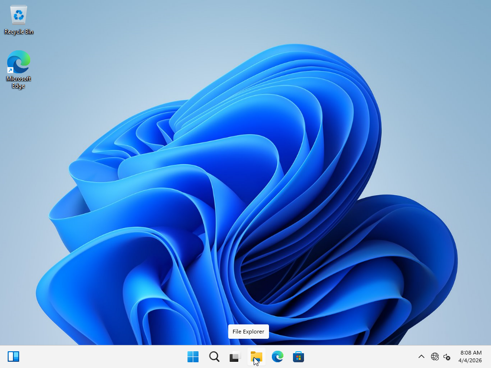
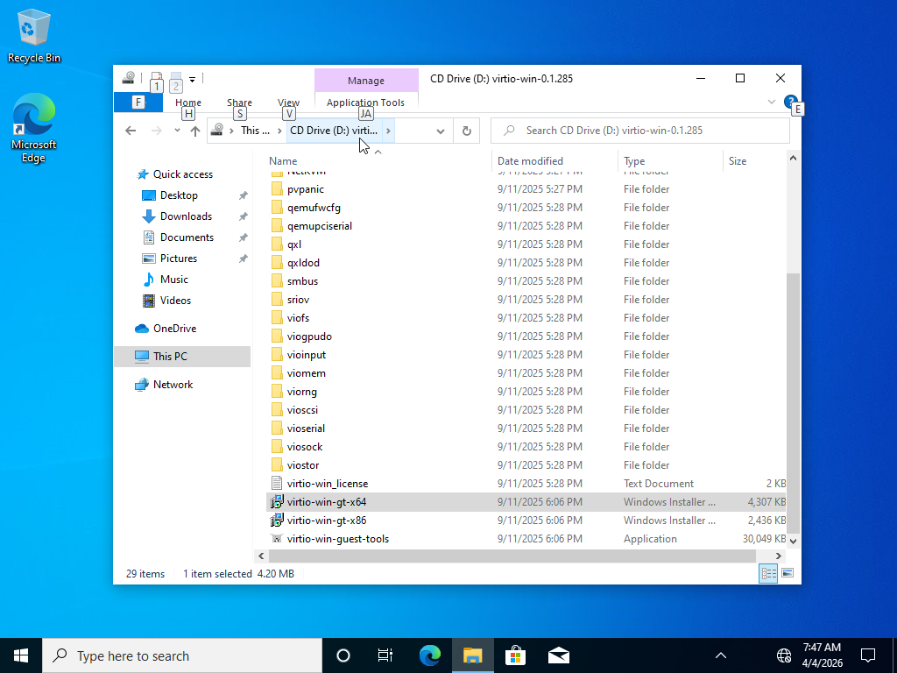
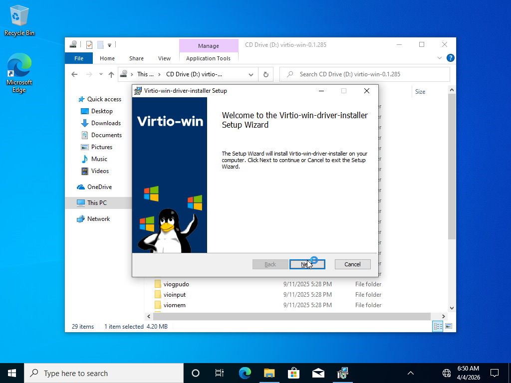

# h2kweb Dashboard User Guide

The h2kweb dashboard is a web-based interface for managing VM migrations from VMware, Hyper-V, and cloud platforms to KVM. It provides real-time monitoring, VM management, VNC console access, and full control over the migration pipeline.

**Default URL:** `https://<host>:5070`
**Example:** `https://185.165.240.5:5070`
**TLS:** HTTPS enabled by default with auto-generated self-signed certificate. Use `--tls-cert none` to disable.

---

## Table of Contents

1. [Getting Started](#1-getting-started)
2. [Dashboard](#2-dashboard)
3. [Migration Workflow](#3-migration-workflow)
4. [Job Monitor](#4-job-monitor)
5. [VM Management](#5-vm-management)
6. [Networks](#6-networks)
7. [Settings](#7-settings)
8. [API Documentation Page](#8-api-documentation-page)
9. [Prometheus Metrics](#9-prometheus-metrics)
10. [Keyboard Shortcuts and Tips](#10-keyboard-shortcuts-and-tips)

---

## 1. Getting Started

### Login

The dashboard uses **PAM authentication**. Log in with any system user account that has shell access on the server. Typically this is `root` or a dedicated operator account created via the Settings page.

Navigate to `https://<host>:5070` and enter your system username and password.

### Navigation

The top navigation bar organizes pages into four dropdown groups:

- **Overview** -- Dashboard
- **Migration** -- Providers, Migrate, Jobs
- **Infrastructure** -- VMs, KubeVirt, Networks
- **System** -- Settings, API Docs

On mobile devices, tap the hamburger menu icon to access navigation.

### Theme Toggle

Click the **Sun/Moon icon** in the top-right header to switch between dark and light mode. The preference is saved in the browser.

### Language Selector

Click **EN** or **DE** in the top-right header to switch the interface language between English and German.

### WebSocket Status

A small colored dot in the top-right corner indicates the live connection status:

- **Green** -- Connected (real-time updates active)
- **Red** -- Disconnected (updates paused, will auto-reconnect)

### Toast Notifications

Job events (started, completed, failed) appear as toast notifications in the corner of the screen, powered by the WebSocket connection.

---

## 2. Dashboard

The dashboard is the main overview page, accessible at `/` or by clicking **Dashboard** in the navigation.

### Stat Cards

Four cards at the top show summary counts:

- **Total Migrations** -- total jobs submitted, with a badge showing active count
- **Completed** -- successful migrations with success rate percentage
- **Failed** -- failed migration count
- **Providers** -- connected providers out of total configured

### Host Resources

Four resource cards with progress bars, refreshed every 10 seconds:

- **CPU** -- core count and load averages (1m / 5m / 15m); bar shows load-to-core ratio
- **Memory** -- used/total with available amount; bar shows memory utilization
- **Root Disk (/)** -- used/total with free space; bar shows disk utilization
- **Libvirt VMs** -- running count out of total defined; bar shows running ratio

Bars turn yellow above 75% and red above 90%.

### Migration Pipeline

A visual pipeline with five stages, each showing a count:

| Stage | Description |
|-------|-------------|
| Queued | Jobs waiting to start |
| Converting | Jobs currently running |
| Fixing | Jobs applying guest OS fixes |
| Deploying | Jobs deploying to libvirt/KubeVirt |
| Done | Completed jobs |

Below the pipeline, the five most recent migrations are listed with status badges and progress bars.

### System Information

A grid of system details:

- **Hostname** -- server hostname
- **OS** -- operating system name
- **Kernel** -- kernel version
- **CPU** -- CPU model string
- **RAM** -- total memory
- **KVM** -- whether `/dev/kvm` is available (green/red)
- **QEMU** -- installed QEMU version
- **Swap** -- swap used / total
- **Uptime** -- human-readable uptime

### Storage Partitions

Lists all disk partitions with:

- Device name, mountpoint, filesystem type
- Usage bar (color-coded by percentage)
- Used, free, and total space

### Libvirt VM List

Shows all defined libvirt domains as tags. Quick reference for what VMs exist on the host.

### Kubernetes / KubeVirt Cluster Info

Shown only when a Kubernetes cluster is detected. Displays:

- Cluster type (K3s or Kubernetes)
- Kubernetes version
- Node count and status (Ready/NotReady)
- Pod count
- KubeVirt VMI count (if KubeVirt is installed)

### Disk Images Inventory

Scans standard directories (`/var/lib/libvirt/images/`, `/data/demo/`, `/var/lib/hyper2kvm/demo/`) for disk images. Each file shows:

- Filename (monospaced)
- Format badge (qcow2, vmdk, raw)
- File size
- **Download button** -- downloads the image directly via the browser

### Providers

Lists connected migration providers (vSphere, Azure, EC2) with connection status. Shows a completion ratio bar for migrations.

### Migration Readiness

Runs 19 system checks to verify the host is ready for migrations. Each check shows a colored status dot (green = ok, yellow = warning, red = error) and a detail string.

The full list of readiness checks:

| Check | What it verifies |
|-------|-----------------|
| `h2kvmctl` | Migration CLI binary found in PATH |
| `qemu_img` | `qemu-img` tool available |
| `qemu_nbd` | `qemu-nbd` tool available |
| `kvm` | `/dev/kvm` device exists |
| `nbd_module` | NBD kernel module loaded (`/sys/module/nbd`) |
| `libvirtd` | libvirtd service is active |
| `libguestfs` | Python guestfs module importable |
| `supermin` | supermin binary available (needed by libguestfs) |
| `guestfish` | guestfish binary available |
| `hivex` | Python hivex module importable (Windows registry editing) |
| `python_augeas` | Python augeas module importable (config file editing) |
| `govc` | govc binary available (vSphere migrations) |
| `virt_install` | virt-install binary (optional — **Create VM** only; migration uses virsh define) |
| `ovmf` | OVMF UEFI firmware found (for UEFI VMs) |
| `bsdtar` | bsdtar binary available (VirtIO ISO extraction) |
| `virtio_win_iso` | VirtIO Windows drivers ISO at `/var/lib/hyper2kvm/virtio-win.iso` |
| `virtio_win_extracted` | VirtIO drivers extracted at `/var/lib/hyper2kvm/virtio-win-extracted/` |
| `runtime_dir` | `/run/hyper2kvm` directory exists (NBD locking) |

Note: checks with "warning" status mean the tool is optional for your use case. Checks with "error" status may block migrations.

### Health Checks

Quick status indicators for core services:

- **KVM** -- hardware virtualization available
- **Libvirt** -- libvirtd responding
- **QEMU** -- QEMU installed
- **K8s** -- Kubernetes cluster reachable (shows K3s or K8s)
- **KubeVirt** -- KubeVirt available with VMI count
- **Memory** -- usage below 90% (warns above 75%)
- **Disk** -- usage below 90% (warns above 75%)

### Recent Activity

A live-updating event feed powered by WebSocket. Shows job lifecycle events (created, started, completed, failed, cancelled) with timestamps. Up to 20 events are displayed.

---

## 3. Migration Workflow

Navigate to **Migration > Migrate** to open the migration hub, then choose a path:

| Path | Description |
|------|-------------|
| **From provider VM** | Export from vSphere, Azure, or EC2 (requires a connected provider) |
| **From disk image** | Browse or upload VMDK, OVA, VHD, QCOW2 on the server |
| **From preset** | Apply a built-in h2kvmctl preset and jump to Configure |

All migration deploy paths use **hyper2kvm (h2kvmctl)**. Libvirt deploy is **virsh define + domain XML** — not `virt-install`. Use **VMs > Create** when you need `virt-install` for new VMs.

The wizard has three steps after you pick a path.

### Step 1: Source

Choose a source type from four options:

| Source | Description |
|--------|-------------|
| **Local File** | Browse or upload VMDK, OVA, VHD, QCOW2 files on the server |
| **VMware vSphere** | Select VMs from a connected vCenter provider |
| **Microsoft Azure** | Select VMs from an Azure subscription provider |
| **AWS EC2** | Select EC2 instances from a connected provider |

Cloud sources (vSphere, Azure, EC2) require a provider to be configured and connected on the Providers page. Unavailable sources are greyed out.

#### Browse Server Tab

A built-in file browser for navigating the server filesystem:

- **Path input** -- type a path and press Go to navigate directly
- **Breadcrumb bar** -- click any path segment to jump to that directory
- **Directory listing** -- folders shown with yellow icons, VM files with blue disk icons
- **VM file detection** -- automatically highlights `.vmdk`, `.ova`, `.ovf`, `.vhd`, `.vhdx`, `.qcow2`, `.raw`, `.img` files
- **Show all files** toggle -- by default only VM-compatible files are shown
- **Selection bar** -- selected file shown at the bottom with format badge

#### Upload from Computer Tab

Upload VM images from your local machine to the server:

- **Drag and drop** -- drag a file onto the upload zone
- **Click to browse** -- click the zone to open a file picker
- **Accepted formats:** VMDK, OVA, OVF, VHD, VHDX, QCOW2, RAW, IMG (up to 50 GB)
- **Progress bar** -- shows upload percentage during transfer
- **Cancel button** -- abort an in-progress upload

##### Resumable Upload

Enable the **Resumable upload** checkbox before uploading. This uses chunked upload mode:

- File is split into **10 MB chunks**
- Each chunk is retried up to **3 times** with a 2-second delay between retries
- Upload session is saved to browser session storage
- If the page is refreshed or the connection drops, a **Resume banner** appears offering to continue from where it left off
- Click **Resume** and select the same file to continue uploading

### Step 2: Configure

Configure migration options organized into collapsible categories.

#### Migration Presets

Three built-in presets for common scenarios:

| Preset | What it sets |
|--------|-------------|
| **VMware Windows 10/11** | Flatten, compress, qcow2, emit XML, skip fstab |
| **VMware Linux (full fixes)** | Flatten, compress, all guest fixes, emit XML, virsh define |
| **Quick Convert (no fixes)** | Flatten, compress, qcow2 only -- no guest modifications |

You can also **save the current configuration as a custom preset** (stored in browser localStorage) and delete custom presets.

#### Configuration Categories

**Output**
- Output Directory -- where converted images are saved (default: `/var/lib/libvirt/images`)
- Output Format -- `qcow2`, `raw`, or `vdi`
- Output Filename -- auto-derived from source if left empty

**Processing**
- Flatten Snapshots -- merge snapshot chain into a single image
- Compress Output -- compress the output image
- Compress Level -- zstd compression level (0-22)

**Guest Fixes**
- fstab Mode -- `stabilize-all` (UUID-based), `uuid`, or `none`
- Regenerate Initramfs -- rebuild initramfs with KVM drivers
- Update GRUB -- reconfigure GRUB bootloader
- Remove VMware Tools -- uninstall VMware guest tools

**Libvirt (hyper2kvm · virsh define)**
- Emit Domain XML -- generate libvirt domain XML via h2kvmctl
- Define VM (virsh define) -- register the VM with libvirt (not virt-install)
- Start VM (virsh start) -- boot the VM after migration
- VM Name -- custom name (auto-derived from source)
- Memory (MB) -- override memory allocation
- vCPUs -- override CPU count

**Kubernetes**
- Deploy to KubeVirt -- deploy as a KubeVirt VM
- Namespace -- Kubernetes namespace (default: `default`)

**OpenStack**
- Upload to Glance -- `deploy_openstack` after conversion (requires `hyper2kvm[openstack]` on server)
- Glance image name, OS_CLOUD, optional Nova flavor/network/keypair and boot/wait toggles
- Mutually exclusive with KubeVirt and local virsh define/start

**Advanced**
- Dry Run -- simulate without making changes
- Verbose Level -- logging verbosity (0-3)
- Report Path -- save a migration report file

### Step 3: Review

- **YAML preview** -- shows the exact `h2kvmctl` YAML configuration that will be used
- **Start Migration** button -- submits the job
- On success, displays the Job ID with a link
- On error, shows the error message

---

## 4. Job Monitor

Navigate to **Migration > Jobs**. This page provides real-time migration monitoring.

### Job List (Left Panel)

- **Filter buttons** -- All, Running, Completed, Failed
- Each job card shows:
  - Job ID (monospaced)
  - Status badge (pending/running/completed/failed/cancelled)
  - Command type and VM name
  - Source file path
  - Progress bar for running jobs
  - Duration for completed jobs

Jobs auto-refresh via WebSocket. Newly created jobs are auto-selected.

### Job Detail (Right Panel)

#### Header

- Job ID, status badge, command, VM name, creation time
- **Duration** -- elapsed time (shown for completed/failed jobs)
- **Source file** path

#### Action Buttons

| Button | When shown | Action |
|--------|-----------|--------|
| **Download Image** | Completed | Downloads the converted disk image |
| **Download Report** | Completed or Failed | Downloads the migration report text file |
| **Cancel** | Running or Pending | Cancels the migration job |

#### Progress Bar

For running jobs, shows:

- Percentage complete with animated bar
- Current step description
- Phase name
- Transfer rate
- Estimated time remaining (ETA)

#### Migration Timeline

A four-stage visual timeline:

1. **Flatten** -- snapshot merging
2. **Offline Fix** -- guest OS modifications (initramfs, GRUB, fstab, VMware tools)
3. **Convert** -- disk format conversion (qemu-img)
4. **Deploy** -- libvirt domain definition, boot test, KubeVirt or OpenStack Glance upload

Each stage shows a status indicator:
- Green check -- completed
- Blue spinner -- currently active
- Grey clock -- pending

The timeline is auto-detected from log output.

#### Deployment Status

Shown after successful completion when a VM was deployed. Displays:

- **Libvirt** panel -- domain name, running state
- **KubeVirt** panel -- VMI name, phase (if KubeVirt deploy was enabled)
- **OpenStack** panel -- configured Glance image name and cloud (if `deploy_openstack` was enabled)
- **Network** panel -- IP addresses with copy and SSH buttons
  - IP detection refreshes every 5 seconds until an address appears

#### Migration Summary

A before/after comparison panel:

- **Source** -- filename and format (VMDK, OVA, etc.)
- **Output** -- filename, format (QCOW2, RAW, etc.), output directory
- **Fixes Applied** -- list of guest modifications performed
- **Deploy** -- list of deployment actions taken

#### Live Logs

A terminal-style log viewer with:

- **Line numbers** -- numbered lines in monospaced font
- **Color coding** -- errors in red, warnings in yellow, success in green, progress in blue
- **Auto-scroll toggle** -- "Following" (green) when auto-scrolling to new output, "Paused" when manually scrolled up
- **Scroll to bottom** button -- appears when scrolled up during active streaming
- **Line count** -- total captured lines shown in the header
- **Streaming indicator** -- green dot with "streaming" text for running jobs

---

## 5. VM Management

Navigate to **Infrastructure > VMs**. Manage libvirt virtual machines.

### Search and Filters

- **Search bar** -- filter VMs by name (case-insensitive)
- **Filter buttons:**
  - All -- show all VMs
  - Running -- show only running VMs
  - Shut Off -- show only stopped VMs
  - Windows -- show only Windows VMs
  - Linux -- show only Linux VMs

### VM List

Each VM row displays:

- **Status dot** -- green (running), yellow (paused), grey (shut off)
- **VM name**
- **OS badge** -- detected OS type (Windows, Ubuntu, RHEL, Fedora, Kali, Debian, Linux)
- **Disk bus badge** -- virtio (green), sata (yellow), or ide
- **Guest agent indicator** -- cyan dot when qemu-guest-agent is active
- **vCPUs and memory** -- resource allocation
- **IP address** -- shown in green when available
- **Quick action buttons** -- Start (for stopped VMs) or Reboot/Shutdown (for running VMs)
- **Status badge** -- current state

### Bulk Actions

Select multiple VMs using the checkboxes, then use the floating action bar:

- **Select All / Deselect All** -- checkbox in the table header
- **Start Selected** -- start all selected VMs
- **Stop Selected** -- gracefully shut down all selected VMs
- **Delete Selected** -- delete all selected VMs and their storage
- **Clear** -- deselect all

### VM Detail Panel

Click a VM to open the detail panel on the right.

#### VM Info

- vCPUs, Memory, VM ID, IP address
- Disk bus type, disk format
- Disk path with **Download Disk Image** button
- Action buttons: Start, Reboot, Shutdown, Force Off

#### VNC Console

Available for running VMs. Click **Open VNC Console** to open a modal window with:

- **Live VNC display** -- uses noVNC via WebSocket proxy (`/api/v1/vnc-proxy/<vmName>`)
- **Connection status** -- Connecting (yellow), Connected (green), Disconnected (red)
- **Focus** button -- captures keyboard input to the VNC session
- **Ctrl+Alt+Del** button -- sends the key combination to the guest
- **Paste** button -- reads your clipboard and types the text into the guest
- **Reconnect** button -- reconnects after a disconnection
- **Fullscreen** toggle -- expands to fill the screen (or uses browser fullscreen API)
- **Close** button -- closes the console modal

The VNC connection uses a WebSocket proxy: `ws://<host>/api/v1/vnc-proxy/<vmName>`.

#### Serial Console

For running VMs, a note shows the `virsh console` command to use from a terminal:

```
virsh console <vm-name>
```

#### Health Check

Click **Run Check** to verify VM health. Tests four things:

| Check | What it tests |
|-------|--------------|
| VM Running | Is the VM in running state |
| IP Address | Does the VM have an IP (shows the IP) |
| SSH Reachable | Can SSH connect to the VM |
| Guest Agent | Is qemu-guest-agent responding |

Each check shows PASS (green) or FAIL (red).

#### Resource Usage

Live CPU and memory utilization for running VMs:

- **CPU bar** -- percentage with color coding (blue < 75%, yellow 75-90%, red > 90%)
- **Memory bar** -- percentage with used/total MB values
- Refreshes every **5 seconds**

#### Screenshot

A thumbnail screenshot of the VM display. Click **Refresh** to capture a new screenshot.

#### Snapshots

Manage VM snapshots:

- **Create** -- enter a name (or auto-generate) and create a snapshot
- **Revert** -- restore the VM to a previous snapshot state
- **Delete** -- remove a snapshot

Each snapshot shows its name and creation date.

#### Delete VM

Click **Delete VM** and confirm to permanently delete the VM and all its storage. This cannot be undone.

---

## 6. Networks

Navigate to **Infrastructure > Networks**. Manage libvirt virtual networks.

### Network List

Each network shows:

- **Status dot** -- green (active) or grey (inactive)
- **Network name**
- **Bridge name** and autostart setting
- **Start/Stop button** -- toggle the network state
- **Status badge**

### Network Topology

Below the network list, a visual topology map shows:

- Each network as a card with its bridge name and state
- **Connected VMs** listed under each network with:
  - VM state indicator (green/yellow/grey)
  - VM name
  - MAC address (monospaced)
  - IP address (green, when available)

---

## 7. Settings

Navigate to **System > Settings**.

### VM Storage

View and manage the libvirt images storage path (`/var/lib/libvirt/images`).

**Current configuration:**
- Images path (with symlink target if relocated)
- Storage device and mountpoint
- Usage bar with used/free/total space
- SELinux status
- Image count and file list

**Relocate Storage:**

Click **Relocate Storage** to move VM images to a different disk. The process:

1. Stops the libvirtd service
2. Moves existing images to the target directory (optional)
3. Creates a symlink from `/var/lib/libvirt/images` to the new location
4. Applies SELinux context (`virt_image_t`)
5. Sets ownership to `qemu:qemu`
6. Restarts the libvirtd service

### Email Notifications

Configure SMTP email notifications for migration events (completed, failed).

Fields:
- SMTP Host, Port (default 587)
- From address
- Username and password
- To addresses (comma-separated)

Use **Send Test Email** to verify the configuration.

### Backup / Restore Config

- **Export Config** -- downloads the current configuration as `hyper2kvm-config.json`
- **Import Config** -- upload a previously exported JSON file to restore settings

The export includes webhooks and email notification configuration.

### Migration Operators (User Management)

Create system users who can log in to the dashboard and run migrations.

**Existing users** are listed with:
- Username, UID, shell, groups
- Sudo badge (green) if they have passwordless sudo

**Create a new operator:**
- Username and password
- Optional: grant sudo access for `h2kvmctl`, `virsh`, `qemu-img`, `mount`

Created users get:
- System account with `/bin/bash` shell
- Group membership: `h2kweb`, `libvirt`, `kvm`, `qemu`
- PAM authentication (can log in to the dashboard)

### Server Configuration

Reference for server-level settings configured via command-line flags or `/etc/default/h2kweb`:

| Flag | Description | Example |
|------|------------|---------|
| `--binary` | Path to h2kvmctl binary | `--binary /usr/local/sbin/h2kvmctl` |
| `--addr` | HTTP listen address | `--addr :5070` |
| `--api-key` | API authentication key | `--api-key YOUR_KEY` |
| `--static-dir` | Dashboard static files | `--static-dir /path/to/dist` |

**Service management commands:**

```bash
systemctl status h2kweb      # Check service status
journalctl -u h2kweb -f      # Follow live logs
systemctl restart h2kweb     # Restart the service
```

---

## 8. API Documentation Page

Navigate to **System > API Docs**. Displays all available REST API endpoints, fetched live from the server.

Endpoints are grouped by category (VMs, Jobs, Upload, Networks, Providers, Auth, etc.) and show:

- **Method badge** -- color-coded: GET (green), POST (blue), DELETE (red), PUT (yellow)
- **Path** -- the API endpoint path (monospaced)
- **Description** -- what the endpoint does

---

## 9. Prometheus Metrics

The dashboard server exposes Prometheus-compatible metrics at:

```
GET https://<host>:5070/metrics
```

This endpoint does **not** require authentication, so it can be scraped by Prometheus without credentials.

### Available Metrics

| Metric | Type | Description |
|--------|------|-------------|
| `h2kweb_migrations_total{status="completed"}` | counter | Completed migrations |
| `h2kweb_migrations_total{status="failed"}` | counter | Failed migrations |
| `h2kweb_migrations_total{status="running"}` | counter | Currently running migrations |
| `h2kweb_migrations_total{status="pending"}` | counter | Pending (queued) migrations |
| `h2kweb_migrations_total{status="cancelled"}` | counter | Cancelled migrations |
| `h2kweb_vms_total{state="running"}` | gauge | Running libvirt VMs |
| `h2kweb_vms_total{state="shutoff"}` | gauge | Shut-off libvirt VMs |
| `h2kweb_uploads_total` | counter | Total file uploads |
| `h2kweb_upload_bytes_total` | counter | Total bytes uploaded |
| `h2kweb_webhooks_registered` | gauge | Number of registered webhooks |
| `h2kweb_host_cpu_cores` | gauge | Number of CPU cores |
| `h2kweb_host_memory_total_mb` | gauge | Total memory in MB |
| `h2kweb_websocket_clients` | gauge | Current WebSocket connections |

### Example Prometheus Configuration

```yaml
scrape_configs:
  - job_name: 'h2kweb'
    static_configs:
      - targets: ['185.165.240.5:5070']
    metrics_path: /metrics
```

---

## 10. Audit Log

The Audit Log page (System → Audit Log) shows a chronological record of all user actions:

- **VM operations** — start, stop, reboot, delete, bulk actions
- **Migration submissions** — batch and individual
- **Snapshot operations** — create, revert, delete
- **Webhook changes** — register, delete
- **Disk bus changes** — promote/demote

Each entry shows: timestamp, user, action, target VM/resource, and result. Filter by action type or search by target name.

---

## 11. Session Timeout

The dashboard automatically logs you out after **30 minutes of inactivity**. Activity is tracked via mouse movement, keyboard input, and clicks.

- **2-minute warning** — a toast notification appears before session expires
- **Auto-logout** — session cleared and redirected to login page
- **Activity resets timer** — any interaction resets the 30-minute countdown

---

## 12. Internationalization (i18n)

The dashboard supports **5 languages**:

| Code | Language | Selector |
|------|----------|----------|
| EN | English | Default |
| DE | Deutsch | German |
| FR | Français | French |
| ES | Español | Spanish |
| JA | 日本語 | Japanese |

Click the language buttons (EN/DE/FR/ES/JA) in the header to switch. Language preference is saved in localStorage and persists across sessions.

---

## 13. Mobile Support

The dashboard is responsive and works on tablets and phones:

- **Navigation** — sidebar collapses to hamburger menu on small screens
- **Stat cards** — stack to 1-2 columns on mobile
- **VM/Job detail panels** — stack below the list on narrow screens
- **Buttons** — touch-friendly sizes
- **Tables** — horizontal scroll for wide content

---

## 14. Debugging

### Verbose Logging

Run h2kvmctl with `-v` or `-vv` for debug output:

```bash
h2kvmctl --config migration.yaml -vv
```

This enables `logger.debug()` messages across the pipeline: NBD locking, registry editing, driver discovery, domain XML decisions, firstboot mechanism results.

### h2kweb Server Logs

```bash
journalctl -u h2kweb -f
```

All API operations are logged with `[component]` prefixes: `[api]`, `[vm]`, `[auth]`, `[upload]`, `[download]`, `[webhook]`, `[email]`, `[ws]`, `[cleanup]`, `[tls]`.

### E2E Migration Test

```bash
sudo ./scripts/test/e2e-migration-test.sh /data/demo/ubuntu2404.vmdk
```

Automated test: detect OS → migrate → verify boot → check IP/SSH → screenshot → cleanup. Exit codes: 0=pass, 1=migration fail, 2=no boot, 3=no network.

---

## 15. Keyboard Shortcuts and Tips

### Global

| Action | How |
|--------|-----|
| Toggle dark/light theme | Click the Sun/Moon icon in the header |
| Switch language | Click language buttons (EN/DE/FR/ES/JA) in the header |
| Check WebSocket status | Hover over the colored dot in the header |

### VNC Console

| Action | How |
|--------|-----|
| Send Ctrl+Alt+Del | Click the "Ctrl+Alt+Del" button in the console toolbar |
| Paste from clipboard | Click the "Paste" button (reads clipboard and types into guest) |
| Toggle fullscreen | Click the maximize/minimize icon |
| Focus keyboard | Click the "Focus" button or click anywhere on the VNC display |
| Reconnect | Click the reconnect button (circular arrow) |

### Job Monitor

| Action | How |
|--------|-----|
| Toggle auto-scroll | Click "Auto-scroll on/off" in the log viewer toolbar |
| Jump to latest output | Click "Scroll to bottom" button (appears when scrolled up) |

### Windows Migration Workflow

Migrating Windows VMs requires a specific workflow because VirtIO drivers are not pre-installed in Windows. The production-proven approach uses SATA disk bus for reliable boot, with a VirtIO driver ISO attached as a CD-ROM for post-boot installation. Tested successfully with Windows 10 Pro (20H2) and Windows 11 Pro (22H2).



*Windows 11 Pro booted successfully on KVM via SATA disk bus after VMware VMDK migration.*

#### Option A: Pre-Install Drivers Before Migration (Recommended)

Install VirtIO drivers **inside the Windows VM while it's still running on VMware**. This eliminates the need for post-migration driver installation entirely.

1. **Download** the latest [virtio-win ISO](https://fedorapeople.org/groups/virt/virtio-win/direct-downloads/stable-virtio/virtio-win.iso) and attach it to the VMware VM as a CD-ROM
2. **Inside the VM**, open the CD drive and run `virtio-win-guest-tools.exe`
3. **Reboot** the VM (still on VMware) to ensure drivers load correctly
4. **Migrate** the VMDK — drivers are already installed, network works on first KVM boot

This is the **cleanest approach** because:
- VirtIO network driver is active immediately on first KVM boot
- QEMU Guest Agent is already running
- No manual steps needed after migration
- Works with any Windows version (7, 8, 10, 11, Server 2012-2025)

> **Note**: Even with pre-installed drivers, the disk bus should remain **SATA** for the migration. The VirtIO storage driver is installed but Windows won't use it for boot unless the registry is configured for boot-start (Start=0), which the installer doesn't do.

#### Option B: Post-Migration Install (If Pre-Install Not Possible)

1. **Migrate with SATA disk bus** -- In the migration wizard, use the **VMware Windows 10/11** preset or manually set the disk bus to SATA. This ensures Windows boots reliably on KVM without needing VirtIO storage drivers pre-installed.

2. **virtio-win.iso auto-attached** -- hyper2kvm automatically attaches the VirtIO Windows driver ISO (`/var/lib/hyper2kvm/virtio-win.iso`) as a CD-ROM device in the generated libvirt domain XML. This appears as the D: drive inside Windows.

3. **First boot** -- Windows boots on the SATA disk controller. There is no network connectivity yet because the VirtIO network driver is not installed. Use the **VNC console** in the VM Management page to access the desktop.

4. **Install drivers** -- Open **This PC** → double-click the **CD Drive (D:) virtio-win** → scroll to the bottom → double-click **virtio-win-guest-tools.exe** (the Application file, ~30 MB). The installer runs and installs all VirtIO drivers automatically.

   

   *The VirtIO CD-ROM drive (D:) as seen in Windows Explorer. Double-click `virtio-win-guest-tools` at the bottom to install all drivers.*

   When the Virtio-win-driver-installer Setup Wizard appears, click **Next** to proceed:

   

   *The VirtIO driver installer wizard. Click Next → Next → Install to complete.*

   For unattended/silent installation from a command prompt:
   ```
   D:\virtio-win-guest-tools.exe /S /norestart
   ```

5. **Verify** -- After the installer completes:
   - Network connectivity is available immediately (no reboot needed)
   - The QEMU Guest Agent starts automatically (IP address appears in the VM list)
   - Memory balloon driver enables dynamic memory management
   - The disk bus remains SATA, which provides adequate performance for production workloads

#### Important Notes

- **SATA disk bus is production-ready** -- VirtIO disk bus requires offline registry edits (setting viostor Start=0 before switching), which the GUI installer does not handle. SATA provides reliable performance without this complexity.
- **VirtIO network works immediately** -- The network driver installed by `virtio-win-guest-tools.exe` activates without a reboot.
- **CD-ROM not visible?** -- Check that the virtio-win ISO exists at `/var/lib/hyper2kvm/virtio-win.iso` and that the domain XML includes a `<disk type='file' device='cdrom'>` entry. Run `sudo ./scripts/quickstart.sh` to auto-download and extract the ISO.
- **Why manual install?** -- hyper2kvm stages multiple automated mechanisms (rhsrvany service, Run key, Startup folder, SetupComplete.cmd). However, migrated VMs have pre-existing user sessions where login-triggered scripts don't fire, and unsigned service binaries (rhsrvany.exe) may be blocked by Windows security policies. The CD-ROM install is the only method that works 100% of the time across all Windows versions.
- **Automated install on fresh login** -- If the user logs out and back in (or reboots), the Startup folder script will attempt to find and run `virtio-win-guest-tools.exe /S` automatically from the CD-ROM. If the CD-ROM is not found, it will show a notification and open the D: drive in Explorer.

### Migration Wizard

| Tip | Detail |
|-----|--------|
| Source auto-detection | The wizard auto-detects format from file extension and sets the command accordingly |
| Windows auto-detection | If the filename contains "win" (e.g., `win10.vmdk`, `win11.vmdk`), the wizard auto-disables Linux-specific fixes (`regen_initramfs=false`, `fstab_mode=noop`) and sets `memory=8192`, `vcpus=4` |
| VM name auto-derivation | VM name and output filename are auto-generated from the source filename |
| Output directory | Defaults to `/var/lib/libvirt/images` when using the file browser |
| Presets | Use built-in presets for common scenarios; save your own for repeated use |
| Resumable uploads | Enable for large files -- survives page refreshes and network interruptions |
