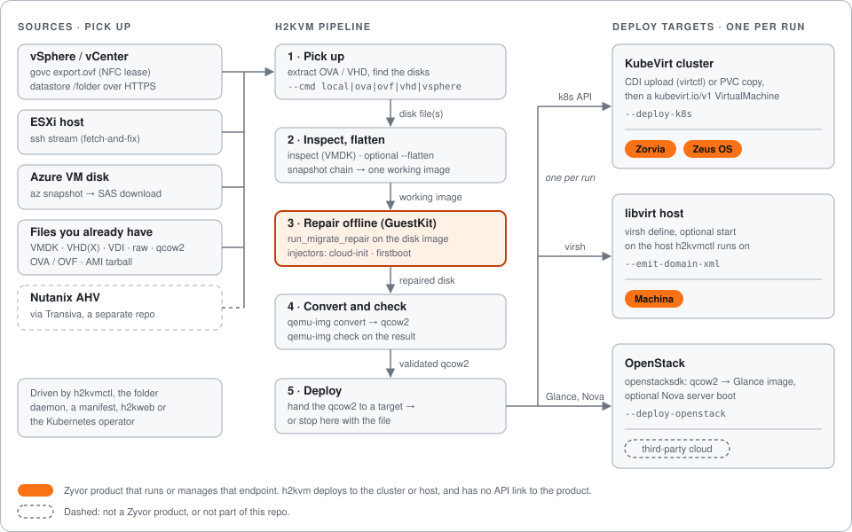
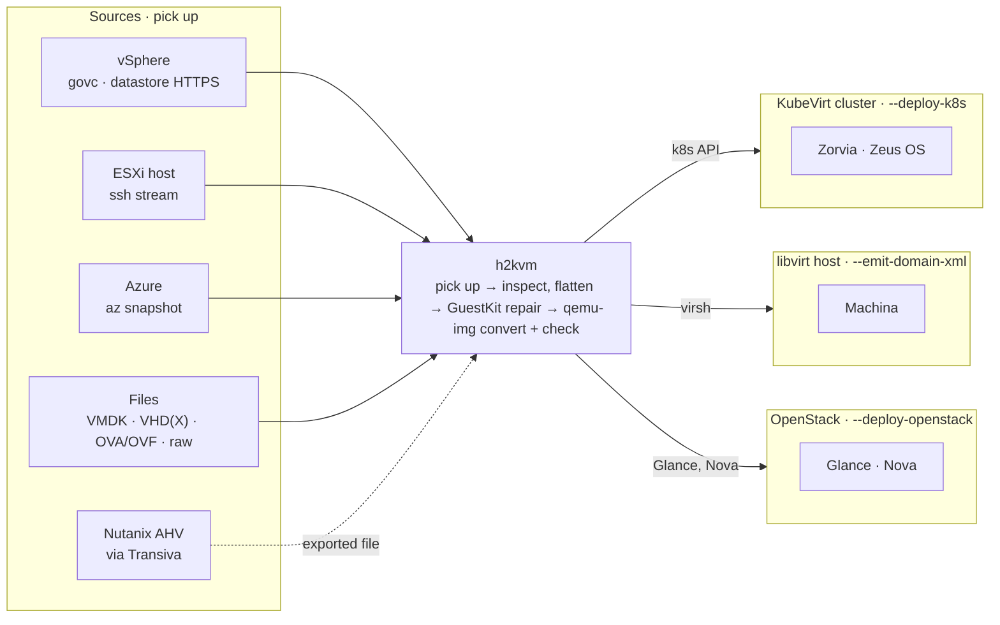

# How h2kvm works

Where disks come from, what happens to the disk, and where the VM lands. Moved from the README, wording unchanged.

[Back to the README](../README.md) · [Documentation index](README.md)

---

h2kvm picks up a disk from wherever the VM lives today, repairs the guest **offline** so it boots on KVM the first time, converts it to qcow2, and hands it to **one** deploy target. Nothing is powered on until the disk is fixed.

## Where disks come from

There are no subcommands and no `--source` flag. Pick the mode with `--cmd` (or `cmd:` in a YAML config passed with `--config`).

| Source | How h2kvm picks it up | Entry point | Status |
|--------|-----------------------|-------------|--------|
| **vSphere** (govc) | `govc export.ovf` pulls the OVF and disks over an HTTPS NFC lease. h2kvm packs the OVA itself | `--cmd vsphere --vcenter … --vs-vm …` | Implemented |
| **vSphere** (datastore) | `GET /folder/…` over HTTPS with the vCenter session, resumable | `--cmd vsphere --vs-download-only` | Implemented |
| **vSphere** (ovftool) | VMware's `ovftool`, if you have it installed | `--cmd vsphere --ovftool-path …` | Implemented, external binary |
| **ESXi over SSH** | Streams the disk with `ssh … cat`, with progress | `--cmd fetch-and-fix --host … --remote …` | Implemented |
| **Azure** | `az` CLI: snapshot, SAS URL, ranged HTTPS download | `--cmd azure --azure-resource-group …` | Implemented |
| **Files you already have** | Disk on the machine running h2kvm. The qemu-img format comes from the suffix | `--cmd local --vmdk FILE` (any format), or `ova`, `ovf`, `vhd`, `raw`, `ami` | Implemented |
| **Folder or manifest** | The daemon watches a folder. `--manifest` runs a declarative 8-stage pipeline | `--cmd daemon`, `--manifest FILE` | Implemented |
| **Nutanix AHV** | Not in this repo. [Transiva](https://github.com/zyvorai/transiva) does the NFS pickup, then you feed the file to `--cmd local` | — | Via Transiva |
| **AWS, Proxmox Backup Server** | Library modules only, not reachable from the CLI | — | Not exposed |
| **GCP, Xen, VirtualBox, remote Hyper-V** | No pickup code. Their disk files (VDI, VHDX) work as local files | — | Not implemented |

## What happens to the disk

1. **Pick up.** Extract an OVA or VHD, or download the disk, then discover the disk files.
2. **Inspect and flatten.** VMDKs are inspected first. `--flatten` merges a snapshot chain into one working image.
3. **Repair offline.** [GuestKit](guestkit-integration.md) runs `run_migrate_repair` on the disk image, then h2kvm injects cloud-init, first-boot, network, user, service and hostname config.
4. **Convert and check.** `qemu-img convert` to qcow2, then `qemu-img check` on the result.
5. **Deploy, or stop.** Hand the qcow2 to one target below, or keep the file.

## Where the VM lands

| Target | What h2kvm does | Enable with | Zyvor product on top |
|--------|-----------------|-------------|----------------------|
| **KubeVirt cluster** | Uploads the disk (containerDisk, CDI `virtctl image-upload`, or a PVC copy), then creates a `kubevirt.io/v1` VirtualMachine on whatever cluster your kubeconfig points at | `--deploy-k8s` | [Zorvia](https://zyvor.dev/zorvia) crafts and watches KubeVirt VMs. [Zeus OS](https://zyvor.dev/zeus-os) is the visual OS for the cluster |
| **libvirt host** | Emits the domain XML and runs `virsh define`, optionally start, on the host h2kvm runs on | `--emit-domain-xml` | [Machina](https://zyvor.dev/machina) is the control plane for libvirt hosts |
| **OpenStack** | openstacksdk uploads the qcow2 to Glance and can boot a Nova server. Endpoints come from the Keystone catalog | `--deploy-openstack` | None. Third-party cloud |

- **One target per run.** The CLI and web API reject combining them. See [OpenStack deployment](guides/openstack-deployment.md).
- **h2kvm has no API link to Zorvia, Zeus OS or Machina.** It deploys to the cluster or host. Those products are what run or manage that endpoint afterwards.
- **OpenStack failures are non-fatal by default.** A failed Glance or Nova step is logged, and the run still succeeds.

| Product | What zyvor.dev says | Site | Repo |
|---------|---------------------|------|------|
| [GuestKit](https://zyvor.dev/guestkit) | Inspects the disk offline so you know it is safe before power-on | [zyvor.dev/guestkit](https://zyvor.dev/guestkit) | [zyvorai/guestkit](https://github.com/zyvorai/guestkit) |
| [h2kvm](https://zyvor.dev/h2kvm) | Any hypervisor to KVM. The guest is fixed so the VM boots the first time | [zyvor.dev/h2kvm](https://zyvor.dev/h2kvm) | [zyvorai/h2kvm](https://github.com/zyvorai/h2kvm) |
| [Zorvia](https://zyvor.dev/zorvia) | Craft and run KubeVirt VMs without hand-written CRDs | [zyvor.dev/zorvia](https://zyvor.dev/zorvia) | [zyvorai/zorvia](https://github.com/zyvorai/zorvia) |
| [Zeus OS](https://zyvor.dev/zeus-os) | The visual infrastructure OS for KubeVirt | [zyvor.dev/zeus-os](https://zyvor.dev/zeus-os) | [zyvorai/zeus-os](https://github.com/zyvorai/zeus-os) |
| [Machina](https://zyvor.dev/machina) | One control plane for the libvirt hosts you already run | [zyvor.dev/machina](https://zyvor.dev/machina) | [zyvorai/machina](https://github.com/zyvorai/machina) |

Hypervisor exit fails when the bootloader is wrong, or Windows still points at the old hypervisor, **after** you cut over. GuestKit and h2kvm do that work before power-on. Zorvia and Zeus OS are where you keep running the VM on KubeVirt, and Machina is where you keep running it on libvirt hosts.
