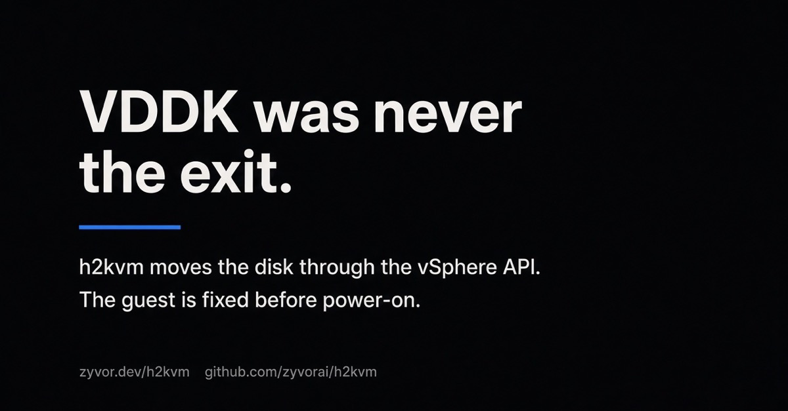

# VDDK was never the exit



On 10 September 2026, VMware told [The Register](https://www.theregister.com/virtualization/2026/09/10/vmware-defends-ending-downloads-of-sdk-that-helps-vm-backups-or-migrations-to-rivals/5295421) that the Virtual Disk Development Kit was never for moving virtual machines.

Most VMware-to-KVM tools still open disks with that kit. The public download pages are gone.

You do not need it. **[h2kvm](https://zyvor.dev/h2kvm?utm_source=linkedin&utm_medium=article&utm_campaign=vddk_2026)** never used it.

---

## What VMware actually said

Simon Sharwood reported the defense in full. VMware did not claim the SDK was withdrawn because of a bug. It claimed the license had always been narrower than the way the industry used it.

Access, VMware told The Register, “is still available through select TAP for its licensed use case, which has always been backup and recovery.” TAP means technology alliance partner. Customers who want backup “can choose from the many approved solutions already available from these partners.”

Then the line that matters for anyone planning an exit:

> The VDDK is not a customer entitlement. It is a software development kit covered by its own developer license and was never included with a Broadcom software purchase.

Read that as a license statement, not a technical one. VMware is saying migration was never the licensed use. The kit remains inside products from selected partners. It is not something a customer bought when they bought VMware.

The Register’s own close is also fair. Copying a VM is among the easier parts of leaving a virtualization platform. Rebuilding networks, security, and storage is harder. On that, we agree.

The disagreement is what follows. Tools that treated VDDK as the way a disk leaves the cluster built the easy part on a license Broadcom now says they never had. Taking the download page down does not make those projects safer. It makes the dependency obvious.

---

## Who still has a phone number

The Register notes that public downloads ended without fanfare, while install guides elsewhere still pointed at links that 404. The cost does not land evenly. A large backup vendor with a partner relationship has someone to call. A customer converting their own estate, or a small team in the middle of a wave, has a forum post.

That is the practical result of “not a customer entitlement.” Backup stays inside the partner program. Exit does not.

Services firms have already found ways to move disks without the kit. The Register says so. The missing piece in that sentence is which path is left, and what still breaks after the disk has moved.

---

## The disk leaves without VDDK

h2kvm and **[Transiva](https://github.com/zyvorai/transiva?utm_source=linkedin&utm_medium=article&utm_campaign=vddk_2026)** do not open VMware disks through that SDK. The disk leaves through the vSphere API and, for Nutanix, through NFS. Conversion happens offline, on a copy you already have.

```text
  vSphere                          Nutanix AHV
     │                                  │
     ▼                                  ▼
  NFC lease (HTTPS)                 NFS pickup
  govc export.ovf / .ova            storage containers
  datastore /folder
     │                                  │
     └──────────────┬───────────────────┘
                    ▼
              h2kvm + GuestKit
           convert · repair · deploy
                    │
                    ▼
         libvirt · KubeVirt · Zeus OS

  VDDK  —  not on this path
```

| Path | How the disk moves | VDDK |
|------|--------------------|:----:|
| [Transiva](https://github.com/zyvorai/transiva?utm_source=linkedin&utm_medium=article&utm_campaign=vddk_2026) NFC | govmomi HTTP NFC lease writes OVF plus disks | No |
| h2kvm `govc` | `export.ovf`, then `export.ova` — the same NFC lease | No |
| Datastore HTTPS | `/folder` download of datastore files | No |
| Nutanix | Transiva NFS pickup of storage containers | No |
| Disk already on disk | `h2kvmctl local` converts VMDK, VHDX, raw, and the other formats | No |

An NFC lease is the same mechanism vSphere already uses to export an OVF. `govc` asks for the lease, writes the descriptor and the disks, and closes it. Nothing in that path is a Virtual Disk Development Kit library linked into the migrator.

If the VMDK, VHDX, or raw file is already on a filesystem you control, you do not need vSphere at all. `h2kvmctl local` converts it and hands the result to the same repair step.

---

## Copying was never the hard part

The Register is right: moving the bits is not the migration.

The failure shows up at power-on. The bootloader still expects the old firmware layout. The initramfs has the old block driver and not the one KVM presents. Windows still points at the hypervisor it left. The disk converted cleanly. The guest did not.

That work happens before the VM is switched on.

**[GuestKit](https://zyvor.dev/guestkit?utm_source=linkedin&utm_medium=article&utm_campaign=vddk_2026)** inspects the disk offline — bootloader, filesystems, Windows — so you know the guest is safe to start. **[h2kvm](https://zyvor.dev/h2kvm?utm_source=linkedin&utm_medium=article&utm_campaign=vddk_2026)** lands it on KVM. **[Zorvia](https://zyvor.dev/zorvia?utm_source=linkedin&utm_medium=article&utm_campaign=vddk_2026)** is where you watch the boot, without hand-written KubeVirt CRDs. **[Zeus OS](https://zyvor.dev/zeus-os?utm_source=linkedin&utm_medium=article&utm_campaign=vddk_2026)** is the visual OS for KubeVirt after that. **[Machina](https://zyvor.dev/machina?utm_source=linkedin&utm_medium=article&utm_campaign=vddk_2026)** is the control plane for the libvirt hosts you already run.

```text
  source disk
    →  GuestKit     inspect the disk before power-on
    →  h2kvm        any hypervisor to KVM
    →  Zorvia       watch the VM boot
    →  Zeus OS      or Machina, where you keep running it
```

VMware’s site-recovery product can move a workload and keep the operational stack. That is a different product, for people staying inside that vendor’s tools. It does not answer the customer who has already decided the next hypervisor is KVM, and who was told this week that the SDK everyone else’s guide still names was never theirs to use.

---

## You were never entitled to the kit. You do not need it.

If a migration plan still starts with “download VDDK,” it is sitting on a license VMware has now said, in public, was never granted for that job. Select partners can still get the kit for backup and recovery. That is what the company told The Register. It is not an exit ramp.

h2kvm 1.2.1 is on PyPI. GuestKit is installed with it.

```bash
pip install "h2kvm==1.2.1"
```

Host needs Linux with `qemu-img`. Repair often needs root, or `H2KVM_USE_SUDO=1`.

| | |
|---|---|
| Product | [zyvor.dev/h2kvm](https://zyvor.dev/h2kvm?utm_source=linkedin&utm_medium=article&utm_campaign=vddk_2026) |
| GuestKit | [zyvor.dev/guestkit](https://zyvor.dev/guestkit?utm_source=linkedin&utm_medium=article&utm_campaign=vddk_2026) · [github.com/zyvorai/guestkit](https://github.com/zyvorai/guestkit?utm_source=linkedin&utm_medium=article&utm_campaign=vddk_2026) |
| h2kvm | [github.com/zyvorai/h2kvm](https://github.com/zyvorai/h2kvm?utm_source=linkedin&utm_medium=article&utm_campaign=vddk_2026) · [PyPI 1.2.1](https://pypi.org/project/h2kvm/1.2.1/) |
| Zorvia | [zyvor.dev/zorvia](https://zyvor.dev/zorvia?utm_source=linkedin&utm_medium=article&utm_campaign=vddk_2026) · [github.com/zyvorai/zorvia](https://github.com/zyvorai/zorvia?utm_source=linkedin&utm_medium=article&utm_campaign=vddk_2026) |
| Zeus OS | [zyvor.dev/zeus-os](https://zyvor.dev/zeus-os?utm_source=linkedin&utm_medium=article&utm_campaign=vddk_2026) · [github.com/zyvorai/zeus-os](https://github.com/zyvorai/zeus-os?utm_source=linkedin&utm_medium=article&utm_campaign=vddk_2026) |
| Machina | [zyvor.dev/machina](https://zyvor.dev/machina?utm_source=linkedin&utm_medium=article&utm_campaign=vddk_2026) · [github.com/zyvorai/machina](https://github.com/zyvorai/machina?utm_source=linkedin&utm_medium=article&utm_campaign=vddk_2026) |
| Transiva | [github.com/zyvorai/transiva](https://github.com/zyvorai/transiva?utm_source=linkedin&utm_medium=article&utm_campaign=vddk_2026) |
| Book a demo | [zyvor.dev/contact](https://zyvor.dev/contact?intent=demo&utm_source=linkedin&utm_medium=article&utm_campaign=vddk_2026) |
| 30-day PoC | [zyvor.dev/poc](https://zyvor.dev/poc?utm_source=linkedin&utm_medium=article&utm_campaign=vddk_2026) |

Bring the wave that was waiting on a download page. The disk does not have to come out through that kit.

Source for the VMware quotes: Simon Sharwood, “VMware defends ending downloads of SDK that helps VM backups – or migrations to rivals,” *The Register*, 10 September 2026.
