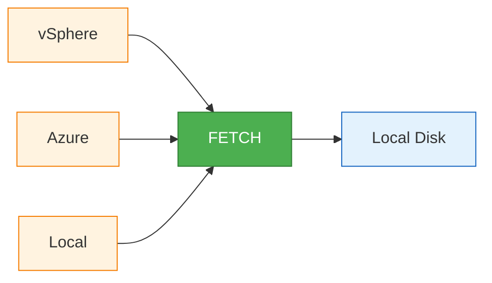
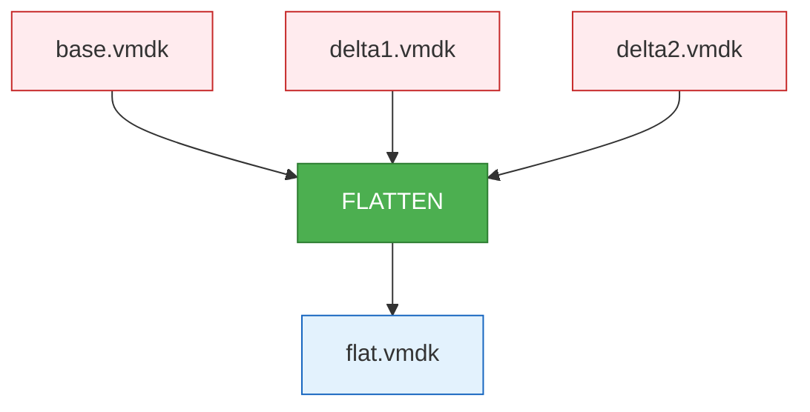
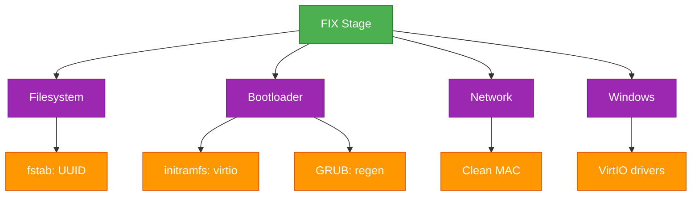
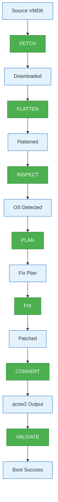
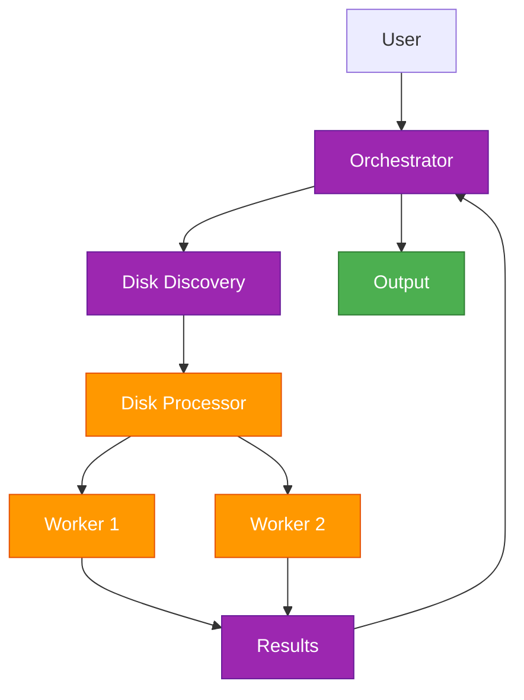

# h2kvm: Pipeline Architecture

## Core Concept

**h2kvm is a multi-stage pipeline** that transforms VMs from any hypervisor to KVM-ready format.

Think of it like an assembly line: each stage does one job, passes the result to the next stage.

---

## The Pipeline Flow


**Stages:**
1. **FETCH** - Get disks from source
2. **FLATTEN** - Collapse snapshot chains
3. **INSPECT** - Detect OS and configuration
4. **PLAN** - Determine required fixes
5. **FIX** - Patch guest OS offline
6. **CONVERT** - Transform disk format
7. **VALIDATE** - Boot test

### Pipeline Rules

✓ **Sequential** - Stages run in strict order
✓ **Deterministic** - Same input → same output
✓ **Isolated** - Each stage has clear inputs/outputs
✓ **Recoverable** - Can resume from checkpoint

---

## Stage Details

### Stage 1: FETCH
**Purpose:** Acquire source VM disks

**Sources:**
- vSphere (VDDK, HTTP, SSH)
- Azure (Managed Disk download)
- Hyper-V (VHD/VHDX files)
- Local filesystem

**Output:** Raw disk files on local storage



---

### Stage 2: FLATTEN
**Purpose:** Collapse snapshot chains into single files

**Problem Solved:**
- VMware snapshots = multiple delta files
- Can't convert fragmented chains directly

**Process:**
- Parse VMDK descriptors
- Read extent chain: base → delta1 → delta2
- Merge into single flat image

**Output:** Single flat disk file



---

### Stage 3: INSPECT
**Purpose:** Detect guest OS and configuration

**Technology:** Guestfs backend (VMCraft by default; offline disk mounting)

**Detects:**
- OS type (Linux distro, Windows version)
- Firmware (BIOS vs UEFI)
- Bootloader (GRUB, GRUB2, systemd-boot)
- Init system (systemd, sysv)
- Partition layout
- Filesystem types
- Network manager

**Output:** GuestIdentity object

```python
GuestIdentity(
    os_type="linux",
    os_distro="rhel",
    os_version="9.3",
    firmware="uefi",
    bootloader="grub2",
    init_system="systemd",
    network_manager="NetworkManager"
)
```

---

### Stage 4: PLAN
**Purpose:** Decide what fixes are needed

**Planning Logic:**
```
IF Windows:
    - Need VirtIO driver injection
    - Need registry modifications
ELSE IF Linux:
    - Check fstab for /dev/disk/by-path
    - Check initramfs for virtio modules
    - Check network config for MAC pinning
```

**Output:** Fix plan (list of required operations)

---

### Stage 5: FIX
**Purpose:** Apply offline fixes to ensure boot on KVM

**The Critical Stage** - This is what makes h2kvm unique!

#### Fix Subsystems



**Fix Details:**

1. **Filesystem Fixer**
   - Rewrite `/etc/fstab`: `/dev/disk/by-path` → UUID
   - Fix mount points

2. **Bootloader Fixer**
   - Rebuild initramfs with virtio drivers
   - Regenerate GRUB configuration
   - Remove hardware-specific references

3. **Network Fixer**
   - Remove MAC address pinning
   - Clean VMware-specific configs
   - Configure for DHCP

4. **Windows Fixer**
   - Inject VirtIO drivers via registry
   - Modify driver load order
   - First-boot configuration

#### Offline vs Live Fixing

| Mode | When | How |
|------|------|-----|
| **Offline** | Default | Mount disk with guestfs backend (VMCraft by default), modify files directly |
| **Live** | Opt-in | SSH to running guest, execute commands |

**Offline is safer** → No runtime dependencies, works on broken VMs

---

### Stage 6: CONVERT
**Purpose:** Transform disk format

**Technology:** qemu-img

**Conversions:**
- VMDK → qcow2 (default)
- VHD → qcow2
- Raw → qcow2
- Any → raw

**Options:**
- Compression (smaller files)
- Sparse allocation (thin provisioning)

**Output:** KVM-native disk format

```bash
# Example conversion
qemu-img convert \
  -f vmdk \              # Input format
  -O qcow2 \             # Output format
  -c \                   # Compress
  input.vmdk \
  output.qcow2
```

---

### Stage 7: VALIDATE
**Purpose:** Verify VM boots on KVM

**Tests:**
- Boot test (QEMU or libvirt)
- Console output analysis
- Kernel panic detection
- Network interface presence

**Output:** Pass/Fail + boot log

---

## Pipeline Execution Modes

### Serial Execution (Default)
```
Disk1: FETCH → FLATTEN → INSPECT → FIX → CONVERT → VALIDATE
Disk2: FETCH → FLATTEN → INSPECT → FIX → CONVERT → VALIDATE
```

### Parallel Execution (Multi-disk VMs)
```
Disk1: FETCH → FLATTEN → INSPECT → FIX → CONVERT
                                                   ↓
Disk2: FETCH → FLATTEN → INSPECT → FIX → CONVERT → VALIDATE
```

---

## Data Flow Example

### Input: VMware RHEL 9 VM



**What happens:**

1. **FETCH**: Download `rhel9.vmdk` from vSphere
2. **FLATTEN**: Collapse 2 snapshots into single file
3. **INSPECT**: Detect "RHEL 9.3, UEFI, systemd"
4. **PLAN**: Determine fixes needed (fstab, initramfs, grub)
5. **FIX**: Apply offline patches
6. **CONVERT**: Transform to compressed qcow2
7. **VALIDATE**: Boot test → Success!

---

## Orchestrator Architecture

The **Orchestrator** coordinates the pipeline:



### Orchestrator Components

**1. DiskDiscovery**
- Finds input disks
- Classifies types (VMDK, VHD, OVA)

**2. DiskProcessor**
- Executes pipeline stages
- Handles errors per-stage
- Parallel or serial execution

**3. VsphereExporter** (optional)
- vSphere-specific export logic
- VDDK/HTTP transport

---

## Recovery & Checkpointing

Pipeline supports resume from failure:


**Checkpoint file example:**
```json
{
  "completed_stages": ["fetch", "flatten"],
  "current_stage": "inspect",
  "resume_from": "/tmp/rhel9-flat.vmdk",
  "timestamp": "2024-01-29T10:30:00Z"
}
```

---

## CLI vs Daemon Pipeline Execution

### CLI Mode: Single Pipeline Run
```
User Command → Pipeline Execution → Exit
```

### CLI Mode Flow


### Daemon Mode: Continuous Pipeline Loop
```
Watch Queue → Detect File → Run Pipeline → Archive → Loop
```

### Daemon Mode Flow


---

## Key Architectural Principles

### 1. Stage Isolation
Each stage has clear responsibilities:
```
FETCH:   Sources → Local disks
FLATTEN: Multi-file → Single file
INSPECT: Disk → Metadata
FIX:     Broken configs → KVM configs
CONVERT: Any format → KVM format
```

### 2. No Stage Skipping
Pipeline order is sacred:
```
✓ ALLOWED:   Skip entire pipeline stage (if not needed)
✗ FORBIDDEN: Reorder stages (FIX before INSPECT)
```

### 3. Deterministic Behavior
Same inputs → Same outputs:
```
rhel9.vmdk → Always produces identical qcow2
```

### 4. Fail-Fast Per Stage
Each stage validates:
```
INSPECT: Can't detect OS? → FAIL (don't proceed to FIX)
FIX:     Can't mount disk? → FAIL (don't proceed to CONVERT)
```

---

## Why Pipeline Architecture?

### ✓ Modularity
Add new sources = new FETCH implementation
Add new OS = new FIX rules
Add new format = new CONVERT handler

### ✓ Testability
Test each stage independently:
```python
def test_flatten_stage():
    input = "multi-extent.vmdk"
    output = flatten(input)
    assert is_single_file(output)
```

### ✓ Debuggability
Pipeline failures are easy to locate:
```
FETCH:   ✓ Success
FLATTEN: ✓ Success
INSPECT: ✓ Success
FIX:     ✗ Failed at fstab rewrite
```

### ✓ Extensibility
New pipeline stage = plug it in:
```
FETCH → FLATTEN → INSPECT → [NEW STAGE] → FIX → CONVERT
```

---

## Summary

**h2kvm = 7-stage pipeline that makes any VM boot on KVM**

```
Source VM → FETCH → FLATTEN → INSPECT → PLAN → FIX → CONVERT → VALIDATE → KVM-ready VM
```

**Each stage does one thing well.**
**Stages run in strict order.**
**Pipeline is deterministic and recoverable.**

**Result:** Reliable, repeatable VM migrations.
